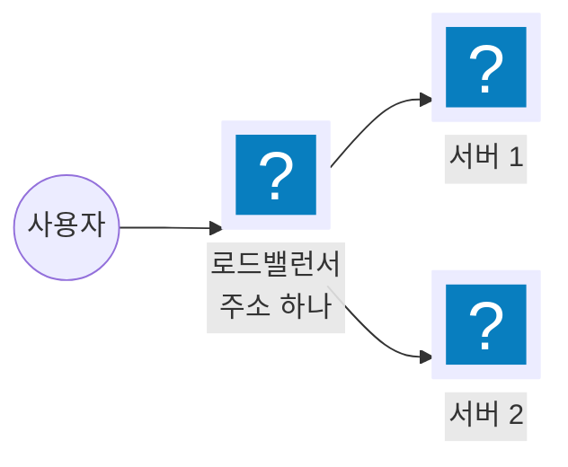
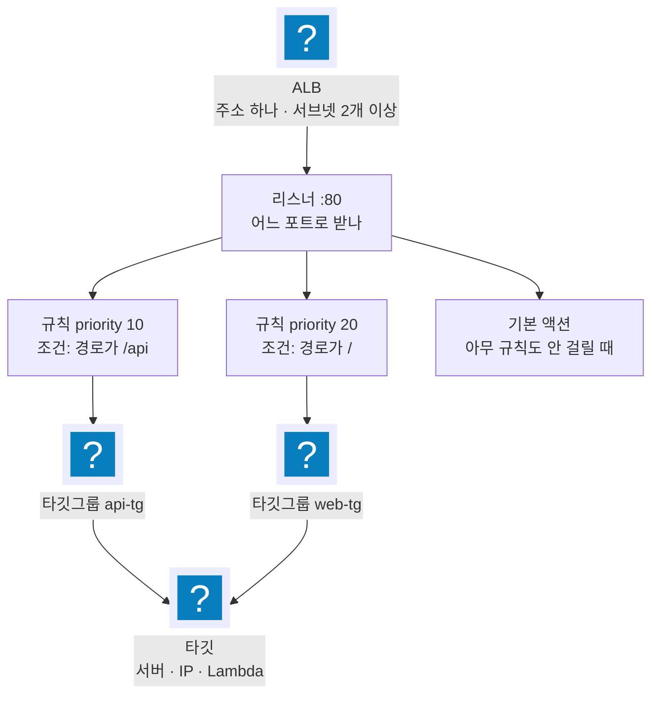

import { Quiz, QuizResults } from 'starlight-quiz/components';
import { Steps, LinkButton } from '@astrojs/starlight/components';

> 문서 유형: explanation

ALB 를 한 번도 안 만들어 본 상태를 전제로 쓴다. ② 까지는 Terraform·쿠버네티스를 몰라도 읽힌다. ③ 부터는 서브넷과 보안 그룹을 전제하므로 [vpc-basics](/start/vpc-basics/) 를 먼저 본다.

## ① 학습 목표

- [ ] 리스너·규칙·타깃그룹·타깃이 각각 무엇이고 어떤 순서로 트래픽을 넘기는지 설명할 수 있다
- [ ] `describe-target-health` 출력의 상태값을 읽고 unhealthy 원인을 좁힐 수 있다
- [ ] 타깃 유형 instance·ip·lambda 중 무엇을 쓸지 판단할 수 있다
- [ ] ALB 와 NLB 를 언제 각각 쓰는지 구분할 수 있다
- [ ] Ingress 와 TargetGroupBinding 중 어느 쪽을 쓸지, 이름 채점이 있을 때 왜 후자인지 설명할 수 있다

## ② 핵심 개념

### 2-0. 로드밸런서가 왜 있나

서버 한 대로 서비스하면 그 한 대가 죽을 때 서비스가 멈춘다. 서버를 두 대로 늘려도 사용자는 어느 쪽으로 가야 할지 모른다.

앞에 한 대를 세워 두고 사용자는 그 한 대에만 접속하게 한다. 뒤에 몇 대가 있는지, 그중 어느 것이 살아 있는지는 앞의 한 대가 판단한다. 그게 로드밸런서다.



AWS 의 HTTP 용 로드밸런서가 **Application Load Balancer(ALB)** 다.

### 2-1. ALB 는 4계층이다

바깥에서 안으로 네 겹이다. 각 겹이 하는 일이 다르다.



| 계층 | 하는 일 | 정하는 것 |
|---|---|---|
| ALB | 주소 하나를 갖고 요청을 받는다 | 이름, 서브넷, 보안 그룹, 인터넷 노출 여부 |
| 리스너 | 어느 포트·프로토콜로 받을지 정한다 | `:80/HTTP`, `:443/HTTPS`(인증서 필요) |
| 규칙 | 요청을 보고 어디로 보낼지 정한다 | 조건(경로·호스트·헤더·메서드)과 액션 |
| 타깃그룹 | 실제 처리할 대상 목록을 들고 있다 | 타깃 유형, 포트, 헬스체크 |
| 타깃 | 요청을 처리한다 | EC2 인스턴스 · IP · Lambda 함수 |

**규칙 평가 방식이 채점에서 자주 걸린다.**

1. 규칙은 `priority` 오름차순으로 평가한다. 숫자가 작을수록 먼저다.
2. **처음 맞는 규칙에서 평가가 끝난다.** 뒤 규칙은 보지 않는다.
3. 아무 규칙도 안 맞으면 리스너의 **기본 액션**이 실행된다.

기본 액션은 "여기까지 왔지만 어떤 규칙에도 안 걸린 요청"의 처리다. 특정 경로로만 들어오게 하려면 기본 액션을 `fixed-response 403` 으로 두고 규칙에서만 통과시킨다.

### 2-2. 헬스체크 — 죽은 대상으로 보내지 않으려면

타깃 목록이 있어도 그중 하나가 죽으면 그쪽으로 간 요청이 실패한다. 그래서 타깃그룹은 **주기적으로 각 타깃에 요청을 보내 살아 있는지 확인**한다. 그게 헬스체크다.

| 설정 | 뜻 | ALB 기본값 |
|---|---|---|
| `HealthCheckPath` | 확인용으로 부를 경로 | `/` |
| `HealthCheckIntervalSeconds` | 몇 초마다 확인하나 | 30 |
| `HealthCheckTimeoutSeconds` | 응답을 몇 초까지 기다리나 | 5 |
| `HealthyThresholdCount` | 몇 번 연속 성공해야 살았다고 보나 | 5 |
| `UnhealthyThresholdCount` | 몇 번 연속 실패해야 죽었다고 보나 | 2 |
| `Matcher` | 어떤 상태 코드를 성공으로 보나 | `200` |

**등록 직후 바로 트래픽이 가지 않는다.** 기본값이면 `30초 × 5회` = 최소 150초를 기다려야 `healthy` 가 된다. 대회처럼 시간이 점수인 상황에서는 간격과 임계를 줄인다.

`aws elbv2 describe-target-health` 출력의 상태값은 여섯 가지다.

| 상태 | 뜻 | 흔한 원인 |
|---|---|---|
| `initial` | 등록됐고 첫 헬스체크가 아직 진행 중 | 방금 등록했다. 기다리면 된다 |
| `healthy` | 정상. 트래픽을 받는다 | — |
| `unhealthy` | 헬스체크 실패 | 경로 오타, 앱이 그 경로에 응답하지 않음, 상태 코드 불일치, 보안 그룹이 헬스체크 포트를 막음 |
| `unused` | 등록됐지만 쓰이지 않는다 | 타깃그룹이 어떤 리스너 규칙에도 연결되지 않았다 |
| `draining` | 등록 해제 중. 진행 중인 요청만 마저 처리한다 | 배포·축소로 대상을 빼는 중 |
| `unavailable` | 판정 불가 | 헬스체크를 껐다(Lambda 타깃그룹의 기본 상태) |

`unhealthy` 가 가장 자주 나오고, 원인의 대부분은 **헬스체크 경로와 앱이 실제로 응답하는 경로가 다른 것**이다. 애플리케이션 쪽 경로를 고쳤으면 타깃그룹 헬스체크 경로도 같이 고쳐야 한다.

### 2-3. 타깃은 무엇이 되나

타깃그룹을 만들 때 **타깃 유형**을 먼저 고르고, 그 뒤로는 그 유형만 등록할 수 있다. 나중에 바꿀 수 없다.

| 타깃 유형 | 등록하는 것 | 트래픽 경로 |
|---|---|---|
| `instance` | EC2 인스턴스 ID | ALB → 인스턴스의 지정 포트 |
| `ip` | IP 주소 | ALB → 그 IP 의 지정 포트 |
| `lambda` | Lambda 함수 ARN | ALB 가 함수를 직접 호출한다 |

`instance` 와 `ip` 의 차이는 홉 수다. `instance` 는 인스턴스를 한 번 거쳐 실제 처리 주체로 간다. `ip` 는 처리 주체에 바로 간다.

쿠버네티스에서는 이 선택이 중요해진다. VPC CNI 가 파드에 VPC IP 를 직접 주므로 `ip` 로 파드를 바로 등록할 수 있고, 그러면 노드를 거치는 홉이 사라진다. Fargate 는 `ip` 만 쓸 수 있다. 자세한 것은 [eks-basics](/start/eks-basics/) 에 있다.

`lambda` 는 서버 없이 응답을 만들 때 쓴다. 함수가 ALB 규격에 맞는 형태로 돌려줘야 한다.

```json
{
  "statusCode": 200,
  "statusDescription": "200 OK",
  "isBase64Encoded": false,
  "headers": { "Content-Type": "text/plain" },
  "body": "ok"
}
```

### 2-4. ALB 와 NLB

AWS 로드밸런서는 두 종류를 주로 쓴다. 이 절은 AWS 공식 문서 기준의 일반 사실이고, 후보 세트 실측이 아니다.

| 항목 | ALB | NLB |
|---|---|---|
| 다루는 계층 | L7 — HTTP·HTTPS 내용을 본다 | L4 — TCP·UDP·TLS 를 그대로 넘긴다 |
| 라우팅 조건 | 경로·호스트·헤더·메서드·쿼리·소스 IP | 없다. 포트로만 나눈다 |
| 주소 | DNS 이름만 준다. IP 는 바뀐다 | AZ 마다 고정 IP. 탄력적 IP 지정 가능 |
| 원본 IP | 뒤에서는 ALB 의 IP 로 보인다. `X-Forwarded-For` 헤더로 전달 | `instance` 타깃이면 원본 IP 가 그대로 보인다 |
| 타깃 유형 | `instance` · `ip` · `lambda` | `instance` · `ip` · `alb` |

HTTP 요청 내용을 보고 나눠야 하면 ALB 다. 고정 IP 가 필요하거나 HTTP 가 아닌 프로토콜이면 NLB 다. 후보 세트 1과제는 전부 ALB 다.
