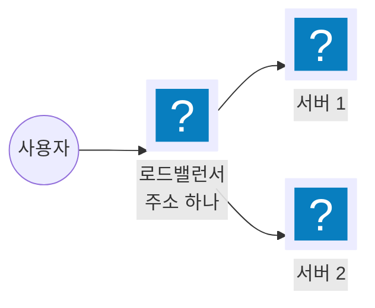
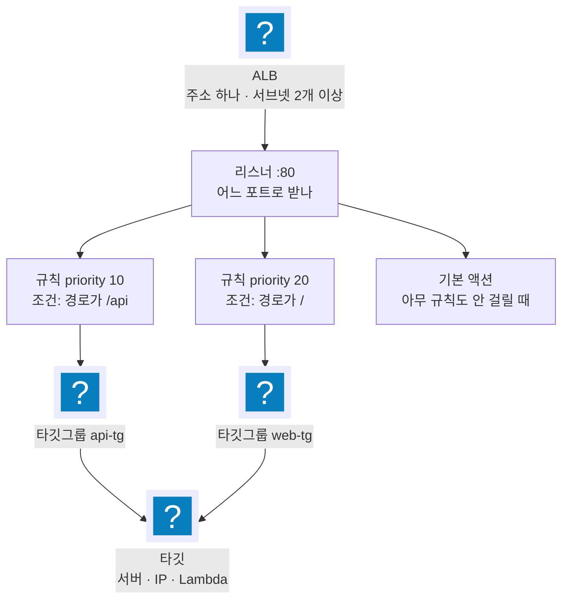
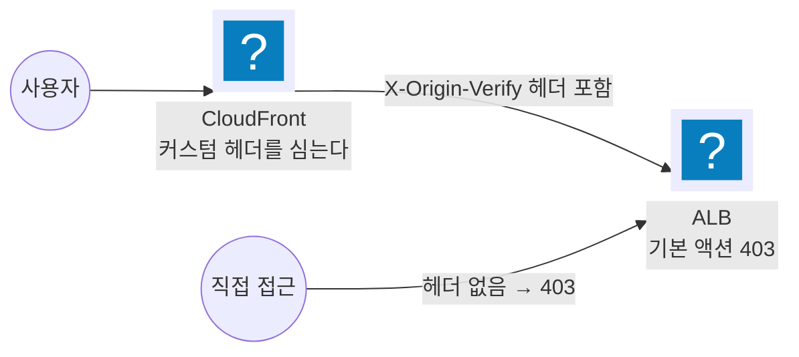
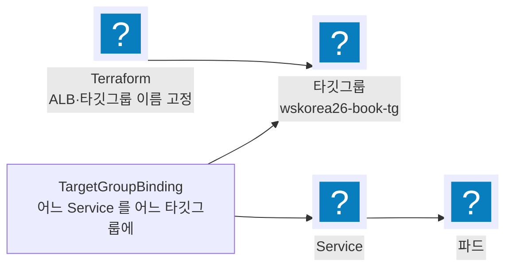

import { Quiz, QuizResults } from 'starlight-quiz/components';
import { Steps, LinkButton } from '@astrojs/starlight/components';

> 문서 유형: explanation

ALB 를 한 번도 안 만들어 본 상태를 전제로 쓴다. ② 까지는 Terraform·쿠버네티스를 몰라도 읽힌다. ③ 부터는 서브넷과 보안 그룹을 전제하므로 [vpc-basics](/start/vpc-basics/) 를 먼저 본다.

## ① 학습 목표

- [ ] 리스너·규칙·타깃그룹·타깃이 각각 무엇이고 어떤 순서로 트래픽을 넘기는지 설명할 수 있다
- [ ] `describe-target-health` 출력의 상태값을 읽고 unhealthy 원인을 좁힐 수 있다
- [ ] 타깃 유형 instance·ip·lambda 중 무엇을 쓸지 판단할 수 있다
- [ ] ALB 와 NLB 를 언제 각각 쓰는지 구분할 수 있다
- [ ] Ingress 와 TargetGroupBinding 중 어느 쪽을 쓸지, 이름 채점이 있을 때 왜 후자인지 설명할 수 있다

## ② 핵심 개념

### 2-0. 로드밸런서가 왜 있나

서버 한 대로 서비스하면 그 한 대가 죽을 때 서비스가 멈춘다. 서버를 두 대로 늘려도 사용자는 어느 쪽으로 가야 할지 모른다.

앞에 한 대를 세워 두고 사용자는 그 한 대에만 접속하게 한다. 뒤에 몇 대가 있는지, 그중 어느 것이 살아 있는지는 앞의 한 대가 판단한다. 그게 로드밸런서다.



AWS 의 HTTP 용 로드밸런서가 **Application Load Balancer(ALB)** 다.

### 2-1. ALB 는 4계층이다

바깥에서 안으로 네 겹이다. 각 겹이 하는 일이 다르다.



| 계층 | 하는 일 | 정하는 것 |
|---|---|---|
| ALB | 주소 하나를 갖고 요청을 받는다 | 이름, 서브넷, 보안 그룹, 인터넷 노출 여부 |
| 리스너 | 어느 포트·프로토콜로 받을지 정한다 | `:80/HTTP`, `:443/HTTPS`(인증서 필요) |
| 규칙 | 요청을 보고 어디로 보낼지 정한다 | 조건(경로·호스트·헤더·메서드)과 액션 |
| 타깃그룹 | 실제 처리할 대상 목록을 들고 있다 | 타깃 유형, 포트, 헬스체크 |
| 타깃 | 요청을 처리한다 | EC2 인스턴스 · IP · Lambda 함수 |

**규칙 평가 방식이 채점에서 자주 걸린다.**

1. 규칙은 `priority` 오름차순으로 평가한다. 숫자가 작을수록 먼저다.
2. **처음 맞는 규칙에서 평가가 끝난다.** 뒤 규칙은 보지 않는다.
3. 아무 규칙도 안 맞으면 리스너의 **기본 액션**이 실행된다.

기본 액션은 "여기까지 왔지만 어떤 규칙에도 안 걸린 요청"의 처리다. 특정 경로로만 들어오게 하려면 기본 액션을 `fixed-response 403` 으로 두고 규칙에서만 통과시킨다.

### 2-2. 헬스체크 — 죽은 대상으로 보내지 않으려면

타깃 목록이 있어도 그중 하나가 죽으면 그쪽으로 간 요청이 실패한다. 그래서 타깃그룹은 **주기적으로 각 타깃에 요청을 보내 살아 있는지 확인**한다. 그게 헬스체크다.

| 설정 | 뜻 | ALB 기본값 |
|---|---|---|
| `HealthCheckPath` | 확인용으로 부를 경로 | `/` |
| `HealthCheckIntervalSeconds` | 몇 초마다 확인하나 | 30 |
| `HealthCheckTimeoutSeconds` | 응답을 몇 초까지 기다리나 | 5 |
| `HealthyThresholdCount` | 몇 번 연속 성공해야 살았다고 보나 | 5 |
| `UnhealthyThresholdCount` | 몇 번 연속 실패해야 죽었다고 보나 | 2 |
| `Matcher` | 어떤 상태 코드를 성공으로 보나 | `200` |

**등록 직후 바로 트래픽이 가지 않는다.** 기본값이면 `30초 × 5회` = 최소 150초를 기다려야 `healthy` 가 된다. 대회처럼 시간이 점수인 상황에서는 간격과 임계를 줄인다.

`aws elbv2 describe-target-health` 출력의 상태값은 여섯 가지다.

| 상태 | 뜻 | 흔한 원인 |
|---|---|---|
| `initial` | 등록됐고 첫 헬스체크가 아직 진행 중 | 방금 등록했다. 기다리면 된다 |
| `healthy` | 정상. 트래픽을 받는다 | — |
| `unhealthy` | 헬스체크 실패 | 경로 오타, 앱이 그 경로에 응답하지 않음, 상태 코드 불일치, 보안 그룹이 헬스체크 포트를 막음 |
| `unused` | 등록됐지만 쓰이지 않는다 | 타깃그룹이 어떤 리스너 규칙에도 연결되지 않았다 |
| `draining` | 등록 해제 중. 진행 중인 요청만 마저 처리한다 | 배포·축소로 대상을 빼는 중 |
| `unavailable` | 판정 불가 | 헬스체크를 껐다(Lambda 타깃그룹의 기본 상태) |

NLB 에서 연결 종료와 드레이닝 간격을 설정하면 `unhealthy.draining` 이 하나 더 보인다. ALB 에는 없다.

`unhealthy` 가 가장 자주 나오고, 원인의 대부분은 **헬스체크 경로와 앱이 실제로 응답하는 경로가 다른 것**이다. 애플리케이션 쪽 경로를 고쳤으면 타깃그룹 헬스체크 경로도 같이 고쳐야 한다.

### 2-3. 타깃은 무엇이 되나

타깃그룹을 만들 때 **타깃 유형**을 먼저 고르고, 그 뒤로는 그 유형만 등록할 수 있다. 나중에 바꿀 수 없다.

| 타깃 유형 | 등록하는 것 | 트래픽 경로 |
|---|---|---|
| `instance` | EC2 인스턴스 ID | ALB → 인스턴스의 지정 포트 |
| `ip` | IP 주소 | ALB → 그 IP 의 지정 포트 |
| `lambda` | Lambda 함수 ARN | ALB 가 함수를 직접 호출한다 |

`instance` 와 `ip` 의 차이는 홉 수다. `instance` 는 인스턴스를 한 번 거쳐 실제 처리 주체로 간다. `ip` 는 처리 주체에 바로 간다.

쿠버네티스에서는 이 선택이 중요해진다. VPC CNI 가 파드에 VPC IP 를 직접 주므로 `ip` 로 파드를 바로 등록할 수 있고, 그러면 노드를 거치는 홉이 사라진다. Fargate 는 `ip` 만 쓸 수 있다. 자세한 것은 [eks-basics](/start/eks-basics/) 에 있다.

`lambda` 는 서버 없이 응답을 만들 때 쓴다. 함수가 ALB 규격에 맞는 형태로 돌려줘야 한다.

```json
{
  "statusCode": 200,
  "statusDescription": "200 OK",
  "isBase64Encoded": false,
  "headers": { "Content-Type": "text/plain" },
  "body": "ok"
}
```

### 2-4. ALB 와 NLB

AWS 로드밸런서는 두 종류를 주로 쓴다. 이 절은 AWS 공식 문서 기준의 일반 사실이고, 후보 세트 실측이 아니다.

| 항목 | ALB | NLB |
|---|---|---|
| 다루는 계층 | L7 — HTTP·HTTPS 내용을 본다 | L4 — TCP·UDP·TLS 를 그대로 넘긴다 |
| 라우팅 조건 | 경로·호스트·헤더·메서드·쿼리·소스 IP | 없다. 포트로만 나눈다 |
| 주소 | DNS 이름만 준다. IP 는 바뀐다 | AZ 마다 고정 IP. 탄력적 IP 지정 가능 |
| 원본 IP | 뒤에서는 ALB 의 IP 로 보인다. `X-Forwarded-For` 헤더로 전달 | `instance` 타깃이면 원본 IP 가 그대로 보인다 |
| 타깃 유형 | `instance` · `ip` · `lambda` | `instance` · `ip` · `alb` |

HTTP 요청 내용을 보고 나눠야 하면 ALB 다. 고정 IP 가 필요하거나 HTTP 가 아닌 프로토콜이면 NLB 다. 후보 세트 1과제는 전부 ALB 다.

## ③ 대회에서 어떻게 쓰이나

여기부터는 채점 문맥이다. 서브넷·보안 그룹을 전제한다.

### 3-1. CloudFront 를 거친 요청만 받는다

ALB 를 인터넷에 열어 두면 CloudFront 를 건너뛰고 직접 때릴 수 있다. 그러면 WAF 도 캐시도 무의미해진다. 막는 방법은 리스너 기본 액션이다.



CloudFront 가 오리진으로 보낼 때 커스텀 헤더를 심고, ALB 규칙이 그 헤더 값을 조건으로 검사한다. 헤더가 없으면 어떤 규칙에도 안 걸려 기본 액션 `fixed-response 403` 으로 떨어진다.

set-02 실측은 규칙이 **정확히 2개**다. 채점(mark 7-2)이 `describe-rules` 출력의 `HttpHeaderConfig.Values[]` 줄 수를 세므로 규칙을 더하거나 빼면 그 항목이 어긋난다. 상세는 [k8s 워크로드·ALB 이론](/part-2/05-k8s-workloads-alb/theory/) 에 있다.

### 3-2. 이름이 채점 대상이다

채점 스크립트는 `wskorea26-book-alb`·`wskorea26-book-tg` 같은 이름으로 리소스를 역조회한다. 이름이 한 글자만 달라도 그 항목을 못 찾는다. ALB 와 타깃그룹 이름은 과제지에 적힌 그대로 쓴다.

### 3-3. Lambda 타깃은 세 리소스가 한 세트다

Lambda 를 ALB 타깃으로 붙이려면 Terraform 리소스 세 개가 다 있어야 한다.

| 리소스 | 역할 |
|---|---|
| `aws_lb_target_group` | `target_type = "lambda"` 로 타깃그룹을 만든다 |
| `aws_lambda_permission` | ALB 가 함수를 호출하도록 허용한다. principal 은 `elasticloadbalancing.amazonaws.com`, source_arn 은 타깃그룹 ARN |
| `aws_lb_target_group_attachment` | 함수를 타깃그룹에 등록한다. `depends_on` 으로 permission 뒤에 온다 |

permission 없이 attach 하면 등록이 실패한다.

## ④ 미니 실습 — 콘솔 30분

:::caution[과금 주의]
ALB 는 시간당 과금이다. 서울 리전 기준 시간당 약 $0.025 에 처리량(LCU)이 더해진다. 30분이면 센트 단위지만 **삭제하지 않으면 계속 붙는다.** 7단계까지 반드시 끝낸다.
:::

EC2 없이 Lambda 하나를 타깃으로 써서 ALB 를 만들어 본다. 만든 다음 CLI 로 읽고, 일부러 고장 내 보고, 지운다.

<Steps>

1. **Lambda 함수를 만든다**

   콘솔에서 Python 런타임으로 함수 하나를 만들고 코드를 넣는다. 함수 이름은 `lb-lab-fn` 으로 한다.

   ```python
   def lambda_handler(event, context):
       return {
           "statusCode": 200,
           "statusDescription": "200 OK",
           "isBase64Encoded": False,
           "headers": {"Content-Type": "text/plain"},
           "body": "ok",
       }
   ```

2. **타깃그룹과 ALB 를 만든다**

   - 타깃그룹: 타깃 유형 **Lambda function**, 이름 `lb-lab-tg`, 함수는 `lb-lab-fn`
   - ALB: 이름 `lb-lab-alb`, 인터넷 경계(internet-facing), 서브넷은 서로 다른 AZ 의 퍼블릭 서브넷 2개, 보안 그룹은 인바운드 TCP 80 을 `0.0.0.0/0` 으로 여는 것 하나
   - 리스너: `:80/HTTP`, 기본 액션은 `lb-lab-tg` 로 전달

   ALB 는 서브넷이 **두 개 이상**이어야 만들어진다. AZ 하나만 고르면 생성 단계에서 막힌다.

3. **응답을 확인한다**

   ALB 상태가 `active` 가 될 때까지 2~3분 걸린다.

   ```bash
   ALB_DNS=$(aws elbv2 describe-load-balancers --names lb-lab-alb \
     --query 'LoadBalancers[0].DNSName' --output text)
   curl -s -o /dev/null -w "%{http_code}\n" "http://$ALB_DNS/"
   ```

   기대: `200`

4. **규칙을 추가해 평가 순서를 본다**

   리스너에 규칙 하나를 더한다. priority `10`, 조건은 경로 `/admin`, 액션은 `fixed-response` 403.

   ```bash
   curl -s -o /dev/null -w "%{http_code}\n" "http://$ALB_DNS/"        # 200 — 규칙 10 에 안 걸려 기본 액션
   curl -s -o /dev/null -w "%{http_code}\n" "http://$ALB_DNS/admin"   # 403 — 규칙 10 에 걸림
   ```

   규칙을 하나 더 만들어 priority `5` 에 같은 `/admin` 경로를 `lb-lab-tg` 로 전달하도록 두면 `/admin` 이 다시 200 이 된다. 숫자가 작은 쪽이 먼저 평가되고 거기서 끝나기 때문이다. 확인했으면 priority 5 규칙은 지운다.

5. **CLI 로 읽는다**

   채점 스크립트가 실제로 뽑는 필드다.

   ```bash
   # ALB — 이름으로 역조회하고 상태·스킴을 본다
   aws elbv2 describe-load-balancers --names lb-lab-alb \
     --query 'LoadBalancers[0].[LoadBalancerName,State.Code,Scheme,Type]'

   # 타깃그룹 — 타깃 유형과 헬스체크 설정
   aws elbv2 describe-target-groups --names lb-lab-tg \
     --query 'TargetGroups[0].[TargetGroupName,TargetType,HealthCheckEnabled,HealthCheckPath]'

   # 규칙 — priority 와 조건. 채점은 이 출력의 줄 수를 세기도 한다
   LISTENER_ARN=$(aws elbv2 describe-listeners \
     --load-balancer-arn $(aws elbv2 describe-load-balancers --names lb-lab-alb \
       --query 'LoadBalancers[0].LoadBalancerArn' --output text) \
     --query 'Listeners[0].ListenerArn' --output text)
   aws elbv2 describe-rules --listener-arn "$LISTENER_ARN" \
     --query 'Rules[].[Priority,Conditions[0].Field,Actions[0].Type]' --output table

   # 타깃 상태
   TG_ARN=$(aws elbv2 describe-target-groups --names lb-lab-tg \
     --query 'TargetGroups[0].TargetGroupArn' --output text)
   aws elbv2 describe-target-health --target-group-arn "$TG_ARN" \
     --query 'TargetHealthDescriptions[].TargetHealth'
   ```

   Lambda 타깃그룹은 헬스체크가 꺼져 있는 것이 기본이라 상태가 `unavailable` 로 나온다. 6단계에서 켠다.

6. **unhealthy 를 재현한다**

   헬스체크를 켜고, 함수가 500 을 돌려주게 바꿔 상태가 넘어가는 것을 본다.

   ```bash
   aws elbv2 modify-target-group --target-group-arn "$TG_ARN" \
     --health-check-enabled --health-check-path / --matcher HttpCode=200 \
     --health-check-interval-seconds 10 --healthy-threshold-count 2 \
     --unhealthy-threshold-count 2
   ```

   20~30초 뒤 `describe-target-health` 가 `healthy` 로 바뀐다. 그다음 콘솔에서 함수의 `statusCode` 를 `500`, `statusDescription` 을 `"500 Internal Server Error"` 로 바꿔 배포한다.

   ```bash
   aws elbv2 describe-target-health --target-group-arn "$TG_ARN" \
     --query 'TargetHealthDescriptions[0].TargetHealth'
   ```

   기대: 20초 안에 `State` 가 `unhealthy` 로, `Reason` 이 `Target.ResponseCodeMismatch` 로 바뀐다. 상태 코드를 200 으로 되돌리면 다시 `healthy` 가 된다.

   이것이 대회에서 가장 자주 겪는 고장 형태다. 애플리케이션의 헬스 경로를 바꿔 놓고 타깃그룹 헬스체크 경로를 안 고치면 같은 결과가 나온다.

7. **지운다**

   ALB → 타깃그룹 → Lambda 순이다. ALB 가 타깃그룹을 참조하고 있어 역순으로는 지워지지 않는다.

   ```bash
   ALB_ARN=$(aws elbv2 describe-load-balancers --names lb-lab-alb \
     --query 'LoadBalancers[0].LoadBalancerArn' --output text)
   aws elbv2 delete-load-balancer --load-balancer-arn "$ALB_ARN"
   aws elbv2 delete-target-group --target-group-arn "$TG_ARN"
   aws lambda delete-function --function-name lb-lab-fn

   # 확인 — 셋 다 없다고 나와야 한다
   aws elbv2 describe-load-balancers --names lb-lab-alb 2>&1 | tail -1
   aws elbv2 describe-target-groups --names lb-lab-tg 2>&1 | tail -1
   aws lambda get-function --function-name lb-lab-fn 2>&1 | tail -1
   ```

   ALB 를 지우면 보안 그룹은 남는다. 실습용으로 새로 만들었으면 함께 지운다.

</Steps>

## ⑤ 심화 — 자동으로 만들 것인가, 이미 있는 것에 붙일 것인가

### 5-1. 문제 상황

앞의 실습처럼 사람이 콘솔에서 ALB 를 만들면, 앱을 새로 띄우거나 서버가 늘고 줄 때마다 손이 간다. 쿠버네티스처럼 대상이 수시로 바뀌는 환경에서는 이것이 성립하지 않는다.

자동으로 만드는 방법이 두 가지고, 둘은 **누가 ALB 를 소유하느냐**가 다르다. 여기서 쓰는 용어 둘을 먼저 정한다.

- **컨트롤러** — 클러스터 안에서 상태를 지켜보다가 AWS API 를 대신 호출하는 프로그램. 여기서는 AWS Load Balancer Controller(LBC)다.
- **Ingress** — HTTP 라우팅 규칙을 적어 두는 쿠버네티스 객체. 자세한 것은 [k8s-basics](/start/k8s-basics/) 에 있다.

### 5-2. 길 A — 선언하면 컨트롤러가 만든다 (Ingress)

Ingress 에 규칙만 적어 두면 LBC 가 **ALB·리스너·규칙·타깃그룹을 통째로** 만들고, 파드가 바뀔 때마다 타깃 등록도 갱신한다. Terraform 에 ALB 를 한 줄도 안 써도 된다.

이름은 이렇게 갈린다.

| 리소스 | Ingress 경로에서 이름을 정할 수 있나 |
|---|---|
| ALB | **가능.** `alb.ingress.kubernetes.io/load-balancer-name` 애노테이션(32자 이하). 생성 시점에만 적용된다 |
| 타깃그룹 | **불가능.** 컨트롤러가 `k8s-` 로 시작하는 이름을 자동으로 짓는다 |

### 5-3. 길 B — 내가 만들고 등록만 맡긴다 (TargetGroupBinding)

ALB 와 타깃그룹은 Terraform 으로 이름을 박아 만든다. 컨트롤러에는 **그 타깃그룹에 파드 IP 를 채우는 일만** 맡긴다. 그 연결을 선언하는 것이 `TargetGroupBinding` 이다.



타깃그룹은 ARN 으로도 이름으로도 지정한다.

```yaml
apiVersion: elbv2.k8s.aws/v1beta1
kind: TargetGroupBinding
metadata:
  name: wskorea26-book-tgb
spec:
  serviceRef:
    name: wskorea26-book-svc
    port: 8080
  targetGroupARN: "<타깃그룹 ARN>"   # 또는 targetGroupName: wskorea26-book-tg
  targetType: ip
```

### 5-4. 왜 대회는 길 B 인가

채점이 `wskorea26-book-tg` 같은 **타깃그룹 이름**으로 리소스를 역조회한다(③-2). 길 A 는 타깃그룹 이름을 정할 수 없으므로 그 항목을 통과할 방법이 없다. ALB 이름은 애노테이션으로 맞출 수 있어도 타깃그룹에서 막힌다.

그래서 이름 채점이 있는 후보 세트는 전부 길 B 다.

### 5-5. 판단 표

| 기준 | 길 A (Ingress) | 길 B (TargetGroupBinding) |
|---|---|---|
| ALB·타깃그룹을 만드는 주체 | 컨트롤러 | Terraform |
| ALB 이름 지정 | 애노테이션으로 가능 | 자유 |
| 타깃그룹 이름 지정 | 불가능 | 자유 |
| 컨트롤러가 맡는 일 | 생성부터 타깃 등록까지 전부 | 타깃 등록만 |
| 쓰는 상황 | 이름 제약이 없을 때. 손이 가장 적게 든다 | 이름·속성이 채점되거나 다른 코드가 ALB 를 참조할 때 |

## ⑥ 자기 점검 퀴즈

<Quiz title="규칙 평가 순서">
리스너에 규칙이 둘 있다. priority 10 은 "경로가 `/admin` 이면 403", priority 20 은 "경로가 `/admin` 이면 타깃그룹으로 전달"이다. `/admin` 요청은 어떻게 되나?

- [x] 403 — priority 10 에서 맞고 거기서 평가가 끝난다
- [ ] 타깃그룹으로 전달 — 나중 규칙이 앞 규칙을 덮어쓴다
  > 규칙은 덮어쓰지 않는다. 처음 맞는 규칙의 액션을 실행하고 평가를 끝낸다.
- [ ] 둘 다 실행되어 403 응답과 전달이 함께 일어난다
  > 액션은 하나만 실행된다. 두 규칙이 같은 조건을 가지면 뒤 규칙은 영영 실행되지 않는다.
- [ ] 조건이 겹치므로 규칙 생성 단계에서 거부된다
  > 조건이 겹쳐도 생성은 된다. 그래서 뒤 규칙이 조용히 죽는 실수가 나온다.

priority 오름차순으로 평가하고 **처음 맞는 규칙에서 끝난다.** 숫자가 작은 10 이 먼저다.

조건이 겹치는 규칙을 두면 뒤 규칙은 실행되지 않는데 오류도 나지 않는다. 규칙이 안 먹는 것 같으면 자기보다 앞 번호에 같은 조건이 있는지부터 본다.
</Quiz>

<Quiz title="unhealthy 원인 좁히기">
`describe-target-health` 가 `unhealthy` 를 반환하고 `Reason` 이 `Target.ResponseCodeMismatch` 다. 애플리케이션은 `/healthz` 에서 200 을 돌려준다. 무엇을 확인하나?

- [x] 타깃그룹의 `HealthCheckPath` 가 `/healthz` 인지 — 기본값 `/` 이면 앱이 404 를 돌려주고 있다
- [ ] 보안 그룹이 헬스체크 포트를 막았는지
  > 그러면 응답 자체가 없어 `Target.Timeout` 이 나온다. `ResponseCodeMismatch` 는 응답이 왔는데 코드가 다르다는 뜻이다.
- [ ] 타깃이 아직 등록 중인지
  > 등록 중이면 `initial` 이다. `unhealthy` 는 헬스체크가 실제로 실패한 상태다.
- [ ] 타깃그룹이 리스너 규칙에 연결됐는지
  > 연결되지 않았으면 `unused` 다. 상태값이 원인의 범위를 이미 좁혀 준다.

`ResponseCodeMismatch` 는 **응답은 왔는데 상태 코드가 `Matcher` 와 다르다**는 뜻이다. 앱이 200 을 주는 경로와 헬스체크가 부르는 경로가 다르면 앱은 404 를 돌려주고 이 이유가 뜬다.

애플리케이션의 헬스 경로를 바꿨으면 타깃그룹의 `HealthCheckPath` 도 같이 바꾼다. 쿠버네티스에서는 readiness probe 경로와도 맞춘다.
</Quiz>

<Quiz title="타깃 유형 고르기">
Fargate 로 띄운 파드를 ALB 타깃으로 붙이려 한다. 타깃그룹의 타깃 유형은?

- [x] `ip` — Fargate 는 노드에 포트를 열 수 없어 `ip` 만 쓸 수 있다
- [ ] `instance` — 파드가 올라간 노드를 등록한다
  > Fargate 는 파드마다 격리된 실행 환경이라 등록할 EC2 인스턴스 자체가 없다.
- [ ] `lambda` — 서버리스이므로
  > `lambda` 는 Lambda 함수 전용이다. Fargate 파드는 함수가 아니다.
- [ ] `alb` — 로드밸런서를 타깃으로 둔다
  > `alb` 타깃 유형은 NLB 에서 ALB 를 뒤에 두는 구성에만 쓴다.

`ip` 다. VPC CNI 가 파드에 VPC IP 를 직접 주므로 그 IP 를 바로 등록한다.

EC2 노드에서도 `ip` 를 쓰면 노드를 거치는 홉이 하나 줄어든다. `instance` 는 노드에 열린 포트로 보낸 뒤 다시 파드로 가는 경로다.
</Quiz>

<Quiz title="Ingress 로는 못 하는 것">
채점이 `wskorea26-book-alb` 와 `wskorea26-book-tg` 두 이름을 모두 문자열로 대조한다. Ingress 하나로 ALB 를 만들면 무엇이 문제인가?

- [x] 타깃그룹 이름을 지정할 수 없다 — ALB 이름은 애노테이션으로 맞출 수 있지만 타깃그룹은 컨트롤러가 자동으로 짓는다
- [ ] ALB 이름과 타깃그룹 이름 둘 다 지정할 수 없다
  > ALB 이름은 `alb.ingress.kubernetes.io/load-balancer-name` 애노테이션으로 지정된다. 막히는 것은 타깃그룹뿐이다.
- [ ] 이름은 둘 다 되지만 리스너 규칙의 우선순위를 정할 수 없다
  > 규칙 우선순위는 Ingress 의 규칙 순서와 애노테이션으로 제어된다. 이름이 문제다.
- [ ] Ingress 는 타깃그룹을 아예 만들지 않는다
  > 만든다. Ingress 경로에서는 ALB·리스너·규칙·타깃그룹이 전부 자동 생성된다.

타깃그룹 이름이다. Ingress 경로에는 타깃그룹 이름을 정하는 애노테이션이 없고, 컨트롤러가 `k8s-` 로 시작하는 이름을 자동으로 짓는다.

그래서 이름이 채점되면 ALB 와 타깃그룹을 Terraform 으로 만들고 `TargetGroupBinding` 으로 파드만 등록시킨다.
</Quiz>

<QuizResults confetti />

## ⑦ 다음 단계

모듈 05 에서 이 구조를 실제로 세운다. Terraform 으로 ALB 와 타깃그룹을 만들고, `TargetGroupBinding` 으로 파드를 등록하고, CloudFront 헤더를 검사하는 리스너 규칙을 붙인다.

<LinkButton href="/start/eks-basics/" icon="right-arrow">다음 선수 학습 — EKS 기초</LinkButton>
<LinkButton href="/part-2/05-k8s-workloads-alb/" variant="minimal">PART 2 — k8s 워크로드·ALB</LinkButton>

## 공식 문서

- [Application Load Balancer 사용 설명서](https://docs.aws.amazon.com/elasticloadbalancing/latest/application/) — 리스너·규칙·타깃그룹 전반
- [리스너 규칙](https://docs.aws.amazon.com/elasticloadbalancing/latest/application/listener-update-rules.html) — 조건 종류와 우선순위 평가
- [타깃그룹 헬스체크](https://docs.aws.amazon.com/elasticloadbalancing/latest/application/target-group-health-checks.html) — 설정값과 상태·이유 코드 전수표
- [Lambda 함수를 타깃으로](https://docs.aws.amazon.com/elasticloadbalancing/latest/application/lambda-functions.html) — 요청·응답 형식
- [Network Load Balancer 사용 설명서](https://docs.aws.amazon.com/elasticloadbalancing/latest/network/) — L4 동작과 고정 IP
- [AWS Load Balancer Controller](https://kubernetes-sigs.github.io/aws-load-balancer-controller/latest/) — Ingress 애노테이션과 TargetGroupBinding
