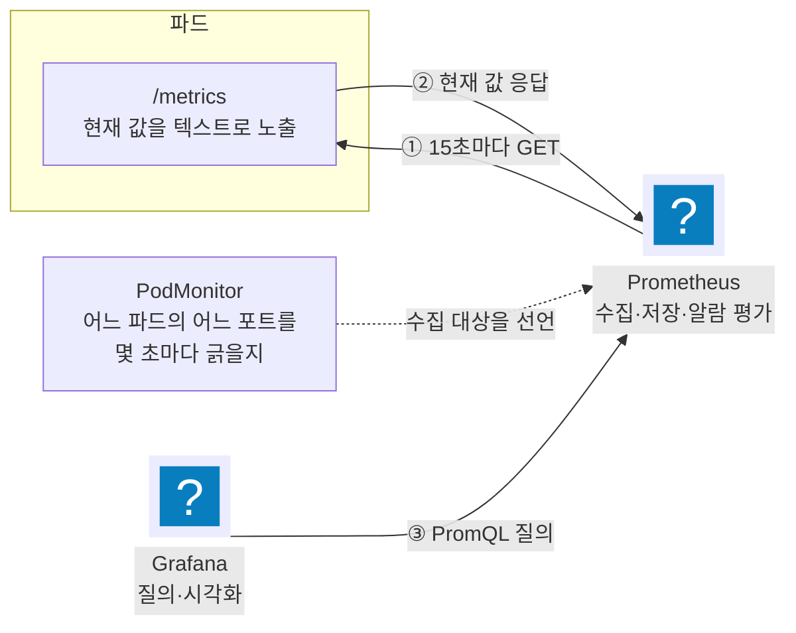

import { Quiz, QuizResults } from 'starlight-quiz/components';
import { LinkButton } from '@astrojs/starlight/components';

> 문서 유형: explanation

## ① 학습 목표

- [ ] Prometheus 가 메트릭을 **가져오는**(pull) 방식으로 모은다는 것을 설명할 수 있다
- [ ] Prometheus 와 Grafana 가 각각 무엇을 맡는지 구분할 수 있다
- [ ] exporter 가 무엇이고 왜 필요한지 설명할 수 있다
- [ ] PodMonitor 가 무엇을 선언하는 리소스인지 안다
- [ ] counter·gauge·histogram 을 각각 언제 쓰는지 구분할 수 있다

## ② 핵심 개념

### 2-1. 메트릭이란 무엇인가

**메트릭(metric)** 은 시간에 따라 변하는 숫자 하나와 그 숫자에 붙은 이름표들이다. 로그가 "무슨 일이 일어났는지"를 문장으로 남긴다면, 메트릭은 "지금 몇인지"를 숫자로 남긴다.

```text
wsc2026_requests_total{method="GET",path="/books",status="200"} 1428
```

이름은 `wsc2026_requests_total`, 값은 `1428`, 중괄호 안은 **라벨**이다. 라벨은 같은 이름의 메트릭을 여러 갈래로 쪼갠다. 위 줄은 "`GET /books` 요청 중 200 으로 끝난 것이 1428건"을 뜻한다.

### 2-2. 수집 모델 — Prometheus 는 가져간다

모니터링 시스템이 숫자를 모으는 방식은 둘이다.

| 방식 | 누가 움직이나 | 예 |
|---|---|---|
| push | 애플리케이션이 서버로 **보낸다** | CloudWatch 사용자 지정 지표, StatsD |
| pull | 서버가 애플리케이션에서 **가져간다** | Prometheus |

Prometheus 는 pull 이다. 애플리케이션은 HTTP 경로 하나에 현재 값을 텍스트로 걸어 두기만 하고, Prometheus 가 주기적으로 그 경로를 호출해 값을 읽어 간다. 이 읽어 가는 동작을 **스크레이프(scrape)** 라고 부른다.

pull 이라서 따라오는 성질이 셋이다.

- 대상이 살아 있는지를 스크레이프 성공 여부로 함께 알 수 있다
- 애플리케이션은 어디로 보낼지 몰라도 된다 — 주소를 아는 쪽은 Prometheus 다
- **Prometheus 가 대상에 네트워크로 닿아야 한다.** 방화벽이나 포트가 막히면 메트릭이 조용히 비어 있다



<details class="diagram-note">
<summary>이 도식이 보여주는 것</summary>

메트릭 한 줄이 화면에 뜨기까지의 경로다. 파드는 `/metrics` 에 현재 값을 걸어 두기만 하고, 어디로 보낼지는 모른다. Prometheus 가 주기마다 그 경로를 호출해 값을 읽고 자기 시계열 저장소에 넣는다. 무엇을 읽을지는 PodMonitor 가 선언해 둔 것을 Prometheus 가 받아 온 것이다. Grafana 는 값을 직접 모으지 않는다 — 화면을 그릴 때마다 Prometheus 에 PromQL 로 물어본다. 점선은 트래픽이 아니라 설정이 흘러가는 방향이다.

</details>

### 2-3. Prometheus 와 Grafana 는 하는 일이 다르다

둘을 한 덩어리로 부르는 자료가 많지만 역할이 겹치지 않는다.

| 도구 | 하는 일 | 하지 않는 일 |
|---|---|---|
| Prometheus | 스크레이프, 시계열 저장, PromQL 질의 처리, 알람 규칙 평가 | 대시보드를 그리지 않는다 |
| Grafana | 데이터소스에 질의를 보내 표·그래프로 그린다 | 메트릭을 수집하거나 저장하지 않는다 |

Grafana 화면이 비었을 때 원인이 두 층으로 갈리는 이유가 이 분담이다. Prometheus 에 값이 아예 없는 것인지, 값은 있는데 Grafana 의 질의나 데이터소스 설정이 틀린 것인지를 먼저 나눠야 한다. Prometheus 자체 UI 에서 같은 질의를 넣어 보면 한 번에 갈린다.

**Alertmanager** 는 세 번째 조각이다. 알람 규칙을 평가하는 것은 Prometheus 이고, 발화한 알람을 묶고 중복을 없애고 알림 채널로 보내는 것이 Alertmanager 다.

### 2-4. exporter — 메트릭을 낼 줄 모르는 것을 위해

애플리케이션이 직접 `/metrics` 를 노출하면 그것으로 끝이다. 그런데 리눅스 노드나 남이 만든 데이터베이스처럼 **고칠 수 없는 대상**이 훨씬 많다.

**exporter** 는 그 대상의 상태를 읽어 Prometheus 형식으로 다시 내주는 중개 프로그램이다. 대상 쪽 코드를 건드리지 않고 메트릭을 얻는 표준 수단이다.

| exporter | 무엇을 읽어 내주나 |
|---|---|
| node-exporter | 노드의 CPU·메모리·디스크·네트워크 |
| kube-state-metrics | 쿠버네티스 오브젝트의 상태 — Deployment 의 원하는 복제본 수, 파드의 Ready 여부 |
| Fluent Bit 의 `prometheus_exporter` 출력 | 로그에서 만들어 낸 메트릭 |

이름은 exporter 지만 방향은 여전히 pull 이다. 어디로 내보내는 것이 아니라 **읽어 갈 수 있게 걸어 두는** 쪽이다.

### 2-5. PodMonitor — 무엇을 긁을지 선언한다

Prometheus 는 스크레이프 대상 목록을 설정 파일로 들고 있다. 쿠버네티스에서는 파드가 뜨고 지므로 그 목록을 손으로 관리할 수 없다.

**Prometheus Operator** 가 이 문제를 CRD 로 푼다. CRD 는 쿠버네티스에 새 리소스 종류를 추가하는 확장 기능이고, Operator 가 추가한 것 중 하나가 **PodMonitor** 다.

PodMonitor 한 장이 선언하는 것은 세 가지다.

1. **어느 파드인가** — `selector.matchLabels` 로 라벨을 지정한다
2. **그 파드의 어느 포트, 어느 경로인가** — `podMetricsEndpoints` 의 `port` 와 `path`
3. **얼마나 자주인가** — `interval`

```yaml
apiVersion: monitoring.coreos.com/v1
kind: PodMonitor
metadata:
  name: fluent-bit
  namespace: observability
spec:
  selector:
    matchLabels:
      app: fluent-bit
  podMetricsEndpoints:
    - port: metrics
      path: /metrics
      interval: 15s
```

<details class="diagram-note">
<summary>이 블록이 하는 일</summary>

`app: fluent-bit` 라벨이 붙은 파드를 찾아, 그 파드의 `metrics` 라는 이름의 포트에서 `/metrics` 를 15초마다 읽으라는 선언이다. Operator 가 이 리소스를 감시하다가 Prometheus 의 스크레이프 설정으로 번역해 넣는다. `port` 에 들어가는 값이 포트 번호가 아니라 컨테이너 포트에 붙인 **이름**이라는 점이 자주 걸린다 — 파드 쪽에 `name: metrics` 가 없으면 대상이 하나도 잡히지 않는다.

</details>

같은 일을 Service 단위로 하는 리소스가 **ServiceMonitor** 다. Service 를 거치지 않고 파드를 직접 긁을 때 PodMonitor 를 쓴다.

### 2-6. 메트릭 종류 — counter · gauge · histogram

메트릭은 값이 변하는 방식에 따라 종류가 나뉘고, 종류마다 질의하는 법이 다르다.

| 종류 | 값의 성질 | 예 | 질의할 때 |
|---|---|---|---|
| counter | 늘기만 한다. 재시작하면 0으로 돌아간다 | 누적 요청 수, 누적 오류 수 | `rate()` 로 초당 증가량을 본다 |
| gauge | 오르내린다 | 메모리 사용량, 현재 큐 길이 | 값을 그대로 본다 |
| histogram | 관측값을 구간별로 세어 담는다 | 응답 시간 분포 | `histogram_quantile()` 로 p95 등을 구한다 |

counter 를 그대로 그리면 계속 오르는 직선만 보인다. **의미가 있는 것은 누적값이 아니라 증가 속도**이므로 `rate(metric[5m])` 처럼 감싸서 본다.

histogram 은 값 하나가 아니라 여러 시계열로 노출된다. 구간별 누적 개수인 `_bucket`, 관측값의 합인 `_sum`, 관측 횟수인 `_count` 셋이 한 벌이다. p95 응답 시간 같은 값은 저장돼 있는 것이 아니라 `_bucket` 에서 계산해 낸다.

## ③ 대회에서 어떻게 쓰이나

관측성은 별도 심화 주제가 아니라 1과제 안에 들어 있다. 후보 세 세트가 모두 Prometheus·Grafana·Fluent Bit 을 요구한다.

set-03 유형의 경로가 가장 특이하다. 앱이 `/metrics` 를 내주지 않으므로 **액세스 로그에서 메트릭을 만든다.**

1. Fluent Bit 이 노드의 컨테이너 로그를 tail 해 method·path·status·duration 을 뽑는다
2. `log_to_metrics` 필터가 그 레코드로 counter 둘과 histogram 하나를 만든다
3. `prometheus_exporter` 출력이 그것을 `:2021/metrics` 에 건다
4. PodMonitor 가 Fluent Bit 파드의 그 포트를 15초마다 긁는다
5. Grafana 대시보드와 PrometheusRule 알람이 그 메트릭을 쓴다

:::danger[채점은 "No Data 패널"을 오답으로 본다]
대시보드에 패널이 있는 것만으로는 부족하다. 값이 그려져 있어야 한다. 메트릭은 요청이 있어야 생기므로, 채점 전에 앱에 트래픽을 넣어 값을 만들어 둔다.
:::

:::caution[메트릭 이름에 접두어가 붙는다]
`log_to_metrics` 로 만든 메트릭의 실제 이름에는 `log_metric_counter_` · `log_metric_histogram_` 접두어가 자동으로 붙는다. 설정에 적은 이름 그대로 PromQL 을 쓰면 아무것도 안 나온다. 배포 후 `:2021/metrics` 를 직접 열어 실명을 확인한다.
:::

## ④ 자가 검증 — 어느 층에서 끊겼는지 가른다

값이 안 보일 때 위에서부터 한 층씩 좁힌다.

```bash
# ① exporter 가 값을 내주고 있나
kubectl exec -n observability <파드> -- curl -s localhost:2021/metrics | head

# ② Prometheus 가 그 파드를 대상으로 잡았나 (Targets 화면)
kubectl port-forward -n monitoring svc/<prometheus-svc> 9090:9090

# ③ PodMonitor 가 Operator 에 읽혔나
kubectl get podmonitor -A
```

<details class="diagram-note">
<summary>이 블록이 하는 일</summary>

끊긴 지점을 세 단계로 좁힌다. ①에서 값이 안 보이면 애플리케이션이나 exporter 문제이므로 Prometheus 를 볼 필요가 없다. ①은 되는데 Prometheus 의 Targets 화면에 대상이 없으면 PodMonitor 의 라벨 셀렉터나 포트 이름이 어긋난 것이다. Targets 에 대상이 있는데 상태가 실패면 네트워크나 경로 문제다. 순서를 건너뛰고 Grafana 대시보드부터 고치기 시작하면 원인이 어느 층인지 모르는 채로 시간을 쓴다.

</details>

## ⑤ 심화 개념

### PodMonitor 가 만들었는데 대상이 안 잡힌다

kube-prometheus-stack 차트는 기본적으로 **자기 릴리스 라벨이 붙은 PodMonitor 만** 고른다. 직접 만든 PodMonitor 에는 그 라벨이 없으므로 조용히 무시된다.

차트 values 의 `prometheus.prometheusSpec.podMonitorSelectorNilUsesHelmValues` 를 `false` 로 두면 릴리스 라벨 없이도 선택된다. PrometheusRule 과 ServiceMonitor 에도 같은 이름의 값이 각각 있다. 알람과 메트릭이 이유 없이 비어 있다면 이 세 값을 먼저 본다.

### 라벨은 조합마다 시계열 하나를 만든다

라벨 값 하나하나가 별개의 시계열이 된다. `path` 라벨에 사용자 ID 가 섞인 URL 을 그대로 넣으면 시계열이 요청 수만큼 늘어난다. 이것을 카디널리티 폭발이라고 부르고, Prometheus 메모리를 그대로 먹는다. 라벨에는 **값의 종류가 정해진 것**만 넣는다.

### 로그와 메트릭은 쓰임이 다르다

| 축 | 로그 | 메트릭 |
|---|---|---|
| 담는 것 | 사건 하나의 전문 | 시간에 따른 숫자 |
| 강한 질문 | "그 요청에 무슨 일이 있었나" | "지금 오류율이 얼마인가" |
| 비용 구조 | 양에 비례 | 시계열 개수에 비례 |

알람은 메트릭으로 걸고 원인 추적은 로그로 한다. 대회 파이프라인이 같은 로그를 CloudWatch Logs 와 Prometheus 두 갈래로 보내는 이유가 이 분담이다.

### 트러블슈팅 사례

| 증상 | 원인 | 확인·대응 |
|---|---|---|
| Grafana 패널이 No Data | 메트릭을 만들 트래픽이 없었다 | 앱에 요청을 넣어 값을 만든다 |
| PromQL 이 아무것도 못 찾는다 | 메트릭 실명에 접두어가 붙어 있다 | `:2021/metrics` 를 직접 열어 이름 확인 |
| Prometheus Targets 가 비어 있다 | PodMonitor 셀렉터 라벨 불일치 | 파드 라벨과 `matchLabels` 대조 |
| PodMonitor 는 있는데 무시된다 | 차트가 릴리스 라벨 붙은 것만 고른다 | `podMonitorSelectorNilUsesHelmValues: false` |
| 포트를 못 찾는다 | `port` 에 번호를 적었다 | 컨테이너 포트의 **이름**을 적는다 |
| counter 그래프가 계속 오르기만 한다 | 누적값을 그대로 그렸다 | `rate(metric[5m])` 로 감싼다 |

## ⑥ 자기 점검 퀴즈

<Quiz title="Prometheus의 수집 방향">
Prometheus 가 메트릭을 모으는 방식으로 옳은 것은?

- [x] Prometheus 가 대상의 HTTP 경로를 주기적으로 호출해 값을 읽어 간다
- [ ] 애플리케이션이 Prometheus 서버로 값을 전송한다
  > 그것은 push 방식이고 CloudWatch 사용자 지정 지표가 그렇게 동작한다. Prometheus 는 반대 방향이다.
- [ ] 애플리케이션이 로그로 남기면 Prometheus 가 로그 파일을 읽는다
  > 로그에서 메트릭을 만드는 것은 Fluent Bit 의 `log_to_metrics` 같은 중간 단계다. Prometheus 가 읽는 것은 그 결과가 걸린 `/metrics` 다.
- [ ] 쿠버네티스 API 서버가 메트릭을 모아 Prometheus 에 넘긴다
  > API 서버는 오브젝트 상태를 갖고 있을 뿐이다. 그 상태를 메트릭으로 바꿔 주는 것이 kube-state-metrics exporter 다.

Prometheus 는 **pull** 이다. 대상은 `/metrics` 에 현재 값을 걸어 두기만 하고, 주소를 아는 쪽은 Prometheus 다. 이 방향 때문에 Prometheus 가 대상에 네트워크로 닿지 못하면 메트릭이 조용히 비어 있게 되고, 반대로 스크레이프 성공 여부 자체가 대상이 살아 있는지를 알려 주는 신호가 된다.
</Quiz>

<Quiz title="Prometheus와 Grafana의 분담">
Grafana 대시보드가 비어 있다. 먼저 확인할 것으로 옳은 것을 **모두** 고르시오.

- [x] Prometheus 자체 UI 에서 같은 질의를 넣어 값이 있는지 본다
- [x] Prometheus Targets 화면에서 대상 파드가 잡혔는지 본다
- [ ] Grafana 가 메트릭을 저장하는 디스크가 찼는지 본다
  > Grafana 는 메트릭을 저장하지 않는다. 화면을 그릴 때마다 데이터소스에 질의를 보낸다.
- [ ] Grafana 의 스크레이프 주기를 줄인다
  > 스크레이프는 Prometheus 가 한다. Grafana 에는 그런 설정이 없다.

Prometheus 는 **모으고 저장하고 평가**하며, Grafana 는 **물어보고 그린다.** 화면이 비면 원인이 두 층 중 하나이므로, Prometheus 쪽에 값이 있는지부터 갈라야 한다. 값이 있는데 화면만 비었다면 데이터소스 설정이나 질의 문제이고, 값 자체가 없다면 수집 경로 문제다.
</Quiz>

<Quiz title="PodMonitor가 선언하는 것">
PodMonitor 의 `podMetricsEndpoints[].port` 에 들어가는 값은 포트 번호가 아니라 컨테이너 포트에 붙인 [[이름]] 이다.

---

PodMonitor 는 "어느 파드의 어느 포트를 얼마나 자주 긁을지"를 선언하는 리소스다. 파드는 `selector.matchLabels` 로 고르고, 포트는 번호가 아니라 파드 정의에서 그 포트에 붙여 둔 이름으로 지정한다. 파드 쪽에 이름이 없으면 대상이 하나도 잡히지 않는데, 오류가 나는 것이 아니라 Targets 목록이 비어 있을 뿐이라 알아채기 어렵다. Prometheus Operator 가 이 리소스를 읽어 Prometheus 의 스크레이프 설정으로 번역한다.
</Quiz>

<Quiz title="메트릭 종류 고르기">
각 상황에 맞는 메트릭 종류로 옳은 것을 **모두** 고르시오.

- [x] 누적 요청 수는 counter 이고, 그래프로 볼 때는 `rate()` 로 감싼다
- [x] 응답 시간의 p95 는 histogram 의 `_bucket` 에서 계산해 낸다
- [ ] 현재 큐 길이는 counter 로 만든다
  > 큐 길이는 줄어들기도 하므로 gauge 다. counter 는 늘기만 하는 값에 쓴다.
- [ ] histogram 은 p95 값을 그대로 저장해 둔다
  > 저장돼 있는 것은 구간별 누적 개수(`_bucket`)와 `_sum`·`_count` 다. 분위수는 `histogram_quantile()` 로 계산한다.

counter 는 늘기만 하고 재시작하면 0 으로 돌아간다. 그래서 누적값 자체가 아니라 **증가 속도**가 의미를 갖고, `rate(metric[5m])` 로 본다. gauge 는 오르내리는 현재 값이라 그대로 그린다. histogram 은 관측값을 구간에 나눠 담으므로 시계열이 `_bucket`·`_sum`·`_count` 세 벌로 늘어나고, 분위수는 그중 `_bucket` 에서 계산해 낸다.
</Quiz>

<Quiz title="PodMonitor를 만들었는데 무시된다">
직접 만든 PodMonitor 가 Prometheus Targets 에 전혀 나타나지 않는다. kube-prometheus-stack 환경에서 가장 먼저 볼 값은?

- [x] `prometheus.prometheusSpec.podMonitorSelectorNilUsesHelmValues` 가 `false` 인지
- [ ] PodMonitor 의 `interval` 이 너무 짧은지
  > 주기가 짧으면 부하가 늘 뿐 대상이 사라지지는 않는다.
- [ ] PodMonitor 를 `monitoring` 네임스페이스에 만들었는지
  > 네임스페이스를 맞춰야 하는 것은 셀렉터 설정에 달렸다. 기본 차트에서 먼저 걸리는 것은 릴리스 라벨 쪽이다.
- [ ] Prometheus 파드를 재시작했는지
  > Operator 가 설정 변경을 반영하므로 손으로 재시작할 일이 아니다.

kube-prometheus-stack 은 기본값으로 **자기 릴리스 라벨이 붙은** PodMonitor·ServiceMonitor·PrometheusRule 만 고른다. 직접 만든 리소스에는 그 라벨이 없어 오류 없이 무시된다. 셋 각각에 같은 이름의 `...SelectorNilUsesHelmValues` 값이 있으므로 함께 `false` 로 둔다. 알람이 안 뜨는 사고도 대부분 원인이 같다.
</Quiz>

<QuizResults confetti />

## ⑦ 다음 단계

PART-2 모듈 13 에서 이 파이프라인을 실제로 세운다. 남은 기초는 2과제 쪽이다.

<LinkButton href="/start/serverless-basics/" icon="right-arrow">다음 선수 학습 — 서버리스·이벤트 기초</LinkButton>
<LinkButton href="/part-2/13-observability/" variant="minimal">PART 2 — 관측성 모듈</LinkButton>

## 공식 문서

- [Prometheus 개념](https://prometheus.io/docs/concepts/data_model/) — 데이터 모델과 메트릭 종류
- [PromQL 기초](https://prometheus.io/docs/prometheus/latest/querying/basics/) — `rate`·`histogram_quantile` 문법
- [Prometheus Operator API](https://prometheus-operator.dev/docs/api-reference/api/) — PodMonitor·ServiceMonitor·PrometheusRule 필드 정본
- [Grafana 프로비저닝](https://grafana.com/docs/grafana/latest/administration/provisioning/) — datasource·dashboard 파일 규격
