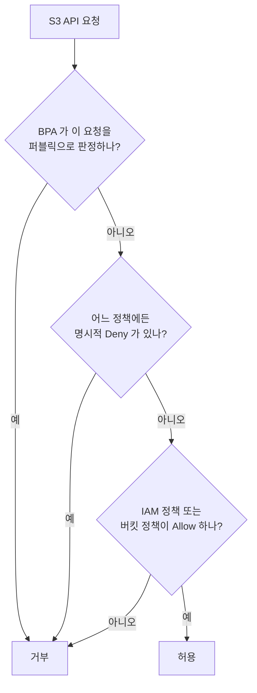
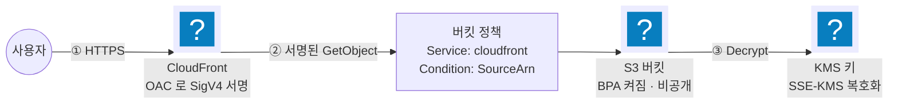

import { Quiz, QuizResults } from 'starlight-quiz/components';
import { Steps, LinkButton } from '@astrojs/starlight/components';

> 문서 유형: explanation

## ① 학습 목표

- [ ] 버킷·객체·키의 관계와 S3가 파일 시스템이 아닌 이유를 설명할 수 있다
- [ ] 퍼블릭 액세스 차단(BPA)·버킷 정책·ACL·객체 소유권이 평가되는 순서를 안다
- [ ] CloudFront OAC가 버킷 정책과 결합해 원본을 비공개로 유지하는 구조를 그릴 수 있다
- [ ] 버전 관리와 삭제 마커, 수명 주기 전환 기준을 채점 관점에서 설명할 수 있다

## ② 핵심 개념

| 용어 | 한 줄 정의 |
|---|---|
| 버킷 | 객체를 담는 최상위 컨테이너. 이름은 **전 계정 전역 유일**, 리전에 귀속 |
| 객체 | 데이터 + 메타데이터 한 덩어리. 최대 5TB |
| 키 | 객체 이름 전체(`img/2026/main.jpeg`). 디렉터리가 아니라 **하나의 문자열** |
| 접두사(prefix) | 키의 앞부분. 콘솔이 폴더처럼 보여줄 뿐 실제 계층은 없다 |
| 버전 관리 | 같은 키에 쓰기가 겹칠 때 이전 객체를 버전으로 남기는 버킷 단위 설정 |
| SSE-KMS | 객체를 KMS 키로 서버 측 암호화. `kms:GenerateDataKey*`·`kms:Decrypt` 필요 |

S3는 **키-값 저장소**다. `a/b/c.txt` 를 지워도 `a/b/` 라는 빈 디렉터리는 남지 않는다 — 애초에 없기 때문이다. 이 성질이 IAM 정책의 `Resource` 표기에 그대로 이어진다. 버킷 자체를 가리키는 ARN(`arn:aws:s3:::bucket`)과 객체를 가리키는 ARN(`arn:aws:s3:::bucket/*`)은 다른 대상이고, `s3:ListBucket` 은 앞의 것에, `s3:GetObject` 는 뒤의 것에 붙는다. 둘을 한쪽 ARN에 몰아 쓰면 조용히 거부된다.

### 접근 통제 4층

S3의 접근 제어는 네 겹이고, 서로 독립적으로 평가된다.

| 층 | 범위 | 역할 |
|---|---|---|
| 퍼블릭 액세스 차단(BPA) | 계정·버킷 | 퍼블릭 허용을 **평가 이전에** 무효화하는 상위 차단기 |
| 버킷 정책 | 버킷 | 리소스 기반 정책. `Principal` 필수. 대회에서 쓰는 주 통제 수단 |
| IAM 정책 | 신원 | 신원 기반 정책. 호출자 쪽에 붙는다 |
| ACL | 버킷·객체 | 레거시 권한 목록. 객체 소유권 설정에 따라 아예 비활성화된다 |



위 도식은 **요청 시점**의 판정이다. BPA는 그보다 앞선 **쓰기 시점**에도 작동한다. `BlockPublicPolicy` 가 켜져 있으면 퍼블릭을 허용하는 버킷 정책은 `PutBucketPolicy` 호출 자체가 거부된다 — 조건 없는 `"Principal": "*"` 가 AWS가 드는 대표 예다. 즉 BPA를 켠 채로 퍼블릭 정책을 넣으면 저장 단계에서 `AccessDenied` 로 막히고, 정책을 먼저 붙인 뒤 BPA를 켜면 정책은 그대로 남은 채 `RestrictPublicBuckets` 가 요청 시점에 판정을 무효화한다. 증상이 다르므로 어느 순서로 켰는지부터 확인한다.

### 객체 소유권과 ACL

객체 소유권(Object Ownership)을 **버킷 소유자 적용(Bucket owner enforced)** 으로 두면 ACL이 통째로 비활성화된다. 2023년 이후 새 버킷의 기본값이 이것이다. ACL로 권한을 주는 예제 코드가 동작하지 않는 대부분의 이유가 여기에 있다. 대회 환경에서는 ACL을 쓰지 않고 버킷 정책으로만 통제한다 — 통제 지점이 하나여야 채점도 디버깅도 단순해진다.

## ③ 대회에서 어떻게 쓰이나

:::danger[채점 함정 — 버킷 이름과 암호화 별칭]
`mark.sh` 는 버킷을 이름으로 찾고, 암호화를 KMS 별칭(`alias/...`)으로 역조회한다. 이름이 한 글자만 달라도, SSE-KMS가 아니라 SSE-S3로 걸려 있어도 그 항목은 0점이다.
:::

- **정적 웹사이트 원본**: 버킷은 비공개로 두고 CloudFront만 읽게 한다. 버킷의 정적 웹사이트 호스팅 기능을 켜는 방식이 아니라 **OAC + 버킷 정책** 조합이 대회 유형이다.
- **SSE-KMS 필수**: 버킷 기본 암호화를 지정 KMS 키로 건다. KMS 키 정책과 버킷 정책 양쪽이 맞아야 업로드가 성공한다.
- 이 내용은 **PART-1 모듈 02(KMS + S3 + CloudFront)** 의 직접적인 기반이다.

## ④ 핵심 코드 패턴

CloudFront OAC를 허용하는 버킷 정책. 원본을 비공개로 두면서 특정 배포판만 읽게 한다.

```json
{
  "Version": "2012-10-17",
  "Statement": [{
    "Sid": "AllowCloudFrontServicePrincipalReadOnly",
    "Effect": "Allow",
    "Principal": { "Service": "cloudfront.amazonaws.com" },
    "Action": "s3:GetObject",
    "Resource": "arn:aws:s3:::wskorea26-site/*",
    "Condition": {
      "StringEquals": {
        "AWS:SourceArn": "arn:aws:cloudfront::123456789012:distribution/E1ABCDEFGH"
      }
    }
  }]
}
```

`Condition` 의 `AWS:SourceArn` 이 없으면 **모든 CloudFront 배포판**이 이 버킷을 읽는다. 서비스 주체를 쓸 때는 소스 ARN을 함께 건다.

상태 자가 검증:

```bash
# 버킷 기본 암호화 설정 확인 — KMS 키 ARN 이 나와야 한다
aws s3api get-bucket-encryption --bucket wskorea26-site

# 퍼블릭 액세스 차단 4개 항목 상태 확인
aws s3api get-public-access-block --bucket wskorea26-site

# 버킷 정책 원문 확인
aws s3api get-bucket-policy --bucket wskorea26-site --query Policy --output text
```

## ⑤ 심화 개념 (응용력 기르기)

### CloudFront OAC — 원본을 비공개로 유지하는 구조

OAC(Origin Access Control)는 CloudFront가 S3 원본을 읽을 때 **SigV4로 요청에 서명**하는 방식이다. 버킷은 `cloudfront.amazonaws.com` 서비스 주체만 허용하면 되고, 퍼블릭 액세스는 계속 차단 상태로 둔다.



선행 방식인 OAI(Origin Access Identity)와의 차이는 세 가지다.

| 항목 | OAI (레거시) | OAC |
|---|---|---|
| 원본에 보이는 신원 | 특수 IAM 신원(오리진 액세스 아이덴티티) | `cloudfront.amazonaws.com` 서비스 주체, SigV4 서명 |
| SSE-KMS 원본 | 지원하지 않는다 | 지원한다 |
| 지원 요청 | `GET`·`HEAD`·`OPTIONS` 등 읽기. `POST` 는 미지원 | 읽기에 더해 동적 요청(`PUT`·`DELETE`) |
| 리전 | 옵트인 리전과 2023년 1월 이후 출범 리전 미지원 | 전 리전 |

**SSE-KMS로 암호화한 버킷은 OAI로 읽을 수 없다.** 대회 유형이 KMS 암호화를 요구하는 이상 OAC 외의 선택지는 없다. 오래된 블로그 예제를 그대로 복사하면 여기서 막힌다.

### 버전 관리와 삭제 마커

버전 관리를 켜면 `DELETE` 요청이 객체를 지우지 않는다. 대신 **삭제 마커(delete marker)** 라는 새 버전을 최신 버전 자리에 올린다.

- `GET` 은 최신 버전인 삭제 마커를 만나 `404` 를 반환한다 — 지워진 것처럼 보인다
- 실제 데이터는 이전 버전으로 그대로 남아 **계속 과금된다**
- 삭제 마커를 지우면 직전 버전이 다시 최신이 된다 — 이것이 실수 복구 경로다
- 진짜로 지우려면 `versionId` 를 지정해 버전마다 삭제해야 한다

`aws s3 rb --force` 나 `terraform destroy` 가 "버킷이 비어 있지 않다"며 실패하는 원인이 대개 이것이다. 잔존 리소스 점검 때는 `aws s3api list-object-versions` 로 버전과 삭제 마커를 함께 확인한다.

### 멀티파트 업로드

100MB를 넘는 객체는 여러 조각으로 나눠 병렬 업로드한다(`CreateMultipartUpload` → `UploadPart` × N → `CompleteMultipartUpload`). 조각 단위로 재시도하므로 큰 파일이 네트워크 오류 한 번에 처음부터 다시 올라가지 않는다.

중단된 업로드의 조각은 **버킷에 남아 과금된다**. 목록에도 객체로 보이지 않아 놓치기 쉽다. 수명 주기 규칙에 `AbortIncompleteMultipartUpload` 를 7일로 걸어두는 것이 표준 대응이다.

### 사전 서명 URL

사전 서명 URL(Presigned URL)은 **발급자의 권한을 시간 제한부로 위임**하는 URL이다. URL 자체에 서명과 만료 시각이 들어 있어 자격 증명 없이도 그 객체 하나에 접근한다.

- 권한의 상한은 **발급한 신원**의 권한이다. 발급자가 `s3:GetObject` 권한을 잃으면 아직 만료되지 않은 URL도 함께 죽는다
- IAM 사용자 자격 증명으로 서명하면 최대 7일, 역할의 임시 자격 증명으로 서명하면 **그 세션 만료 시각**이 상한이다
- 발급 자체는 API 호출이 아니라 로컬 서명 연산이다 — CloudTrail에 발급 기록이 남지 않는다

### 스토리지 클래스와 수명 주기

| 클래스 | 최소 보관 | 꺼내는 데 걸리는 시간 | 쓰는 자리 |
|---|---|---|---|
| Standard | 없음 | 즉시 | 상시 접근 |
| Standard-IA | 30일 | 즉시 | 월 1회 이하 접근, 크기 128KB 이상 |
| Intelligent-Tiering | 없음 | 즉시 | 접근 패턴을 모를 때 |
| Glacier Instant Retrieval | 90일 | 즉시 | 분기 1회 접근 아카이브 |
| Glacier Deep Archive | 180일 | 수 시간 | 법적 보관 |

최소 보관 기간 전에 삭제하거나 전환하면 **남은 기간만큼 요금이 청구된다**. 작은 객체를 무턱대고 Standard-IA로 내리면 전환 요청 비용과 128KB 미만 객체의 최소 과금 때문에 오히려 비싸진다.

수명 주기 규칙은 접두사·태그·객체 크기로 대상을 좁혀 전환과 만료를 자동화한다. 버전 관리를 켠 버킷에서는 **최신 버전과 이전 버전에 각각 다른 규칙**을 건다 — 이전 버전은 30일 뒤 만료, 미완료 멀티파트 조각은 7일 뒤 중단이 흔한 조합이다.

### 이벤트 알림과 교차 리전 복제

- **이벤트 알림**: 객체 생성·삭제·복원 시 Lambda·SQS·SNS·EventBridge로 이벤트를 보낸다. 최소 한 번 전달(at-least-once)이라 **같은 이벤트가 두 번 올 수 있다** — 수신 측은 멱등하게 짠다.
- **복제(CRR/SRR)**: 버전 관리가 켜진 버킷 사이에서 객체를 비동기 복제한다. 다른 리전이면 CRR, 같은 리전이면 SRR이다. **규칙을 건 이후에 올라온 객체만** 복제되고, 기존 객체는 배치 복제를 따로 돌려야 한다. SSE-KMS 객체를 복제하려면 대상 리전의 KMS 키에 대한 권한을 복제 역할에 함께 부여한다.

### 트러블슈팅 사례

| 증상 | 원인 | 확인·대응 |
|---|---|---|
| 버킷 정책은 맞는데 퍼블릭 접근이 안 된다 | BPA가 켜져 평가 이전에 차단 | `get-public-access-block` 확인. 대회에서는 BPA를 끄지 말고 OAC로 우회 |
| CloudFront가 `AccessDenied` 를 반환 | 버킷 정책의 `SourceArn` 이 배포판 ARN과 불일치 | 배포판 ID를 다시 확인. OAC 생성 후 정책 갱신을 빠뜨린 경우가 많다 |
| SSE-KMS 버킷에서 CloudFront 404·403 | OAI를 쓰고 있다 | OAC로 교체. OAI는 SSE-KMS 원본을 읽지 못한다 |
| `terraform destroy` 가 버킷에서 멈춘다 | 버전·삭제 마커·미완료 멀티파트 조각 잔존 | `list-object-versions`·`list-multipart-uploads` 로 확인 후 정리 |
| 업로드가 `KMS.AccessDeniedException` | 업로더 역할에 `kms:GenerateDataKey*` 누락 | KMS 키 정책의 사용 권한 목록을 확인 |
| 사전 서명 URL이 만료 전에 죽는다 | 역할 세션으로 서명해 세션 만료가 상한이 됐다 | 장기 자격 증명으로 서명하거나 세션 수명을 늘린다 |

## ⑥ 자기 점검 퀴즈

<Quiz title="퍼블릭 액세스 차단과 버킷 정책의 우선순위">
BPA가 켜진 버킷에 `"Principal": "*"`, `"Action": "s3:GetObject"` 를 허용하는 버킷 정책을 적용했다. 결과는?

- [x] `BlockPublicPolicy` 가 `PutBucketPolicy` 를 거부해 정책 저장 자체가 `AccessDenied` 로 실패한다
- [ ] 버킷 정책이 리소스 기반 정책이므로 BPA를 덮고 퍼블릭 읽기가 허용된다
  > BPA는 정책 평가에 참여하는 규칙이 아니라 그 앞에 놓인 차단기다. 정책이 이길 수 있는 자리가 아니다.
- [ ] 정책은 저장되지만 퍼블릭 읽기만 조용히 차단된다
  > 그 증상은 정책을 먼저 붙인 뒤 BPA를 켰을 때다. 켜 둔 상태에서 새로 넣으면 저장이 먼저 막힌다.
- [ ] BPA가 자동으로 해제되고 퍼블릭 읽기가 허용된다

BPA의 네 설정 중 `BlockPublicPolicy` 는 **쓰기 시점의 차단기**다. 퍼블릭을 허용하는 정책은 저장 단계에서 거부되므로 콘솔에도 오류가 뜬다. "정책은 저장되고 접근만 막힌다" 는 정책을 먼저 붙인 뒤 BPA를 켠 경우이며, 이때는 `RestrictPublicBuckets` 가 요청 시점에 판정을 무효화한다. 대회에서는 BPA를 켠 채로 두고 CloudFront OAC로 읽기 경로를 만드는 것이 정답 구조다.
</Quiz>

<Quiz title="ListBucket 과 GetObject 의 대상 ARN">
`aws s3 ls s3://my-bucket/` 은 성공하는데 객체 다운로드가 거부된다. 정책에서 확인할 것은?

- [x] `s3:GetObject` 의 `Resource` 가 `arn:aws:s3:::my-bucket/*` 인지
- [ ] `s3:ListBucket` 의 `Resource` 에 `/*` 를 붙였는지
  > `s3:ListBucket` 은 버킷 자체에 대한 액션이다. `/*` 를 붙이면 오히려 목록 조회가 깨진다.
- [ ] 버킷의 리전이 CLI 프로필의 리전과 같은지
  > 리전이 다르면 목록 조회부터 실패한다. 목록이 나온 시점에 리전 문제는 아니다.
- [ ] BPA가 켜져 있는지
  > BPA는 퍼블릭 판정에만 관여한다. 인증된 IAM 신원의 요청은 BPA와 무관하다.

버킷 ARN(`arn:aws:s3:::my-bucket`)과 객체 ARN(`arn:aws:s3:::my-bucket/*`)은 **다른 리소스**다. `s3:ListBucket` 은 앞의 것에, `s3:GetObject`·`s3:PutObject` 는 뒤의 것에 붙는다. 두 줄을 한 `Statement` 에 몰아넣고 ARN을 하나만 쓰면 반쪽만 동작한다.
</Quiz>

<Quiz title="SSE-KMS 원본에서 OAI가 막히는 이유">
SSE-KMS로 기본 암호화한 버킷을 CloudFront 원본으로 붙였다. 오래된 블로그 예제대로 OAI를 만들어 버킷 정책에 넣었더니 `403` 이 돌아온다. 맞는 대응은?

- [x] OAC로 교체한다 — OAI는 SSE-KMS 원본을 읽지 못한다
- [ ] BPA를 꺼서 CloudFront가 원본을 읽게 한다
  > BPA는 퍼블릭 판정에만 관여한다. OAI든 OAC든 인증된 요청이므로 BPA를 꺼도 이 오류는 그대로다.
- [ ] 버킷 정책의 `Principal` 을 `"*"` 로 바꾼다
  > 원본을 퍼블릭으로 여는 방향이다. 비공개 원본 유지가 이 구조의 목적이라 정반대 대응이다.
- [ ] 버킷의 정적 웹사이트 호스팅을 켜고 그 엔드포인트를 원본으로 쓴다
  > 대회 유형은 OAC + 버킷 정책 조합이다. 웹사이트 엔드포인트는 버킷을 열어야 해서 쓰지 않는다.

OAC는 `cloudfront.amazonaws.com` 서비스 주체로 **SigV4 서명**한 요청을 보내므로 KMS 복호화 경로까지 성립한다. 반면 OAI는 SSE-KMS 원본을 지원하지 않는다 — 서명 버전 문제가 아니라 AWS가 문서로 못박은 기능 공백이다(옵트인 리전·동적 요청도 같은 목록에 있다). 대회 유형이 KMS 암호화를 요구하는 이상 선택지는 OAC 하나뿐이고, `403` 을 정책 오타로 오해해 시간을 버리기 쉬운 지점이다.
</Quiz>

<Quiz title="버전 관리 버킷의 DELETE">
버전 관리가 켜진 버킷에 `DELETE` 요청을 보내면 객체가 지워지지 않는다. 대신 최신 버전 자리에 올라오는 새 버전을 [[삭제 마커]] 라고 한다.

---

`GET` 은 이 최신 버전을 만나 `404` 를 반환하므로 지워진 것처럼 보이지만, 실제 데이터는 이전 버전으로 남아 **계속 과금된다**. 이것을 지우면 직전 버전이 다시 최신이 되므로 실수 복구 경로가 되고, 진짜로 지우려면 `versionId` 를 지정해 버전마다 삭제해야 한다. 잔존 리소스 점검 때는 `aws s3api list-object-versions` 로 버전과 함께 확인한다.
</Quiz>

<Quiz title="버킷이 비워지지 않는 이유">
버전 관리를 켠 버킷에서 `terraform destroy` 가 "버킷이 비어 있지 않다"며 멈춘다. 남아 있을 수 있는 것으로 옳은 것을 **모두** 고르시오.

- [x] 이전 버전 객체
- [x] 삭제 마커
- [x] 중단된 멀티파트 업로드의 조각
- [ ] 콘솔에서 만든 빈 폴더
  > S3에는 디렉터리가 없다. 콘솔의 폴더는 키 접두사를 그렇게 보여주는 것일 뿐이라 따로 남지 않는다.
- [ ] 버킷에 걸어둔 수명 주기 규칙
  > 규칙은 버킷 설정이지 객체가 아니다. 버킷 비우기의 대상이 아니다.

삭제 마커와 이전 버전은 `aws s3api list-object-versions` 로, 미완료 멀티파트 조각은 `aws s3api list-multipart-uploads` 로 확인한다. 특히 멀티파트 조각은 **객체 목록에 보이지 않으면서 과금된다** — 수명 주기 규칙에 `AbortIncompleteMultipartUpload` 를 7일로 걸어두는 것이 표준 대응이다. 잔존 리소스는 대회에서 감점 요인이므로 정리 확인까지가 한 세트다.
</Quiz>

<Quiz title="사전 서명 URL이 예정보다 일찍 죽는 경우">
역할의 임시 자격 증명으로 서명해 만료를 7일로 지정한 사전 서명 URL이 몇 시간 만에 `403` 을 낸다. 원인은?

- [x] 역할 세션의 만료 시각이 URL 유효 기간의 상한이 되기 때문
- [ ] 사전 서명 URL은 한 번 쓰면 무효화되기 때문
  > 횟수 제한은 없다. 만료 전까지는 몇 번이든 같은 URL로 접근할 수 있다.
- [ ] BPA가 켜져 있어 서명된 요청이 차단되기 때문
  > BPA는 퍼블릭 판정에만 관여한다. 사전 서명 URL은 발급자의 권한을 실어 보내는 인증된 요청이다.
- [ ] 발급 기록이 CloudTrail에 남지 않아 요청이 검증되지 않기 때문
  > 발급은 로컬 서명 연산이라 기록이 남지 않는 것이 맞지만, 그것이 접근 거부의 원인은 아니다.

사전 서명 URL은 **발급한 신원의 권한을 시간 제한부로 위임**한다. IAM 사용자 자격 증명으로 서명하면 최대 7일이지만, 역할의 임시 자격 증명으로 서명하면 지정한 만료와 무관하게 그 세션이 끝나는 순간 URL도 함께 죽는다. 발급자가 `s3:GetObject` 권한을 잃어도 마찬가지다. 오래 살아야 하는 URL은 장기 자격 증명으로 서명하거나 세션 수명을 늘린다.
</Quiz>

<QuizResults confetti />

## ⑦ 다음 단계

모듈 02에서 KMS·S3·CloudFront를 Terraform으로 한 스택에 묶는다.

<LinkButton href="/start/docker-basics/" icon="right-arrow">다음 선수 학습 — Docker 기초</LinkButton>
<LinkButton href="/part-1/02-kms-s3-cloudfront/" variant="minimal">PART 1 — KMS + S3 + CloudFront 실습</LinkButton>

## 공식 문서

- [Amazon S3 사용 설명서](https://docs.aws.amazon.com/AmazonS3/latest/userguide/) — 버킷·객체·정책 전반
- [퍼블릭 액세스 차단](https://docs.aws.amazon.com/AmazonS3/latest/userguide/access-control-block-public-access.html) — 4개 설정 항목의 정확한 의미
- [CloudFront OAC로 S3 원본 제한](https://docs.aws.amazon.com/AmazonCloudFront/latest/DeveloperGuide/private-content-restricting-access-to-s3.html) — OAC 설정과 버킷 정책 예시
- [수명 주기 구성](https://docs.aws.amazon.com/AmazonS3/latest/userguide/object-lifecycle-mgmt.html) — 전환·만료 규칙 작성법
