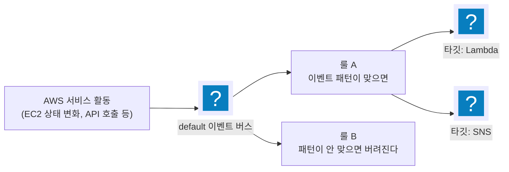

import { Quiz, QuizResults } from 'starlight-quiz/components';
import { LinkButton } from '@astrojs/starlight/components';

> 문서 유형: explanation

**선수 학습 14/18.** [iam-basics](/start/iam-basics/)를 먼저 읽는다 — 서비스끼리 부르는 권한이 이 문서의 절반이다.

2과제 모듈의 절반이 이 다섯 서비스 위에 서 있다. [모듈 14](/part-4/14-serverless-event/)·[모듈 15](/part-4/15-eks-scaling/)의 이론은 "이미 안다"를 전제로 채점 함정만 압축해 두었다. 그 문서에서 EventBridge 룰이나 가시성 제한 시간이 낯설게 느껴지면 여기서 먼저 채운다.

## ① 학습 목표

- [ ] Lambda가 **동기 호출**과 **비동기 호출**, **이벤트 소스 매핑**에서 각각 어떻게 불리는지 구분할 수 있다
- [ ] EventBridge의 이벤트 버스·룰·이벤트 패턴·타깃이 각각 무엇인지 설명하고, 패턴이 이벤트와 매칭되는 규칙을 안다
- [ ] 어떤 변경은 네이티브 이벤트로 오고 어떤 변경은 CloudTrail을 경유하는지, 그래서 지연이 왜 갈리는지 설명할 수 있다
- [ ] Step Functions 상태 머신에서 Task 하나가 API 하나에 대응한다는 제약과 그 결과를 안다
- [ ] SQS의 가시성 제한 시간이 무엇을 정하는지, 처리 시간보다 짧으면 무슨 일이 생기는지 설명할 수 있다

---

## ② 핵심 개념

### 1. Lambda — 누가 부르느냐로 동작이 갈린다

**Lambda** 는 코드를 올려 두면 서버를 마련하거나 관리하지 않고 그 코드를 실행해 주는 서비스다. 호출이 들어올 때만 깨어나고, 실행된 시간만큼만 과금된다. "서버리스"라는 말이 가리키는 것이 이 실행 방식이다.

Lambda 함수는 **핸들러**(`파일명.함수명`)를 진입점으로 실행된다. 핸들러가 `remediate_security_group.lambda_handler`면 zip 안에 `remediate_security_group.py`가 있고 그 안에 `lambda_handler(event, context)`가 있어야 한다 — 파일명을 바꾸면 코드가 멀쩡해도 실행 자체가 안 된다.

중요한 건 **호출 방식 세 가지**다. 무엇이 함수를 부르느냐에 따라 재시도·오류 처리·이벤트 모양이 전부 달라진다.

| 방식 | 누가 부르나 | 실패하면 | 이벤트 모양 |
|---|---|---|---|
| **동기 호출**(RequestResponse) | ALB, API Gateway, `aws lambda invoke` | 호출자에게 오류가 그대로 반환된다 | 호출자 규격(ALB면 ALB 이벤트 포맷) |
| **비동기 호출**(Event) | S3 이벤트 알림, SNS, **EventBridge** | Lambda가 **자동으로 2회 재시도**, 그래도 실패하면 DLQ(처리에 실패한 메시지를 따로 모아 두는 큐)로 보내거나 버린다 | 서비스가 만든 이벤트 JSON |
| **이벤트 소스 매핑**(ESM) | Lambda 서비스가 **직접 폴링**한다 — SQS, DynamoDB Streams, Kinesis, MSK | 배치가 큐로 되돌아가 재처리된다 | 폴링해 모은 **레코드 배열**(`Records`) |

표에 호출자로 나온 서비스 중 이 문서에서 처음 나오는 넷은 한 줄씩 짚고 간다.

| 이름 | 무엇인가 |
|---|---|
| API Gateway | HTTP 엔드포인트를 만들어 들어온 요청을 Lambda 같은 뒤쪽 서비스로 넘기는 관문 |
| DynamoDB Streams | DynamoDB 테이블의 항목 변경을 일어난 순서대로 흘려 주는 변경 기록 |
| Kinesis | 대량의 실시간 데이터를 순서대로 받아 두고 여러 소비자가 나눠 읽게 하는 스트림 서비스 |
| MSK | AWS 가 대신 운영해 주는 Apache Kafka 클러스터 |

ESM만 방향이 반대라는 점이 핵심이다. SQS·Streams는 "이벤트를 밀어 주는" 것이 아니라 **Lambda가 대신 가서 꺼내 온다**. 그래서 SQS 트리거를 붙였다면 큐에 권한을 주는 것이 아니라 **함수 실행 역할에 `sqs:ReceiveMessage`·`DeleteMessage`가 필요**하다.

### 2. EventBridge — 버스·룰·패턴·타깃

EventBridge는 AWS 안에서 오가는 이벤트를 받아 조건에 맞으면 다른 서비스로 넘겨 주는 **이벤트 라우터**다. 네 조각으로 나뉜다.

- **이벤트 버스(Event Bus)** — 이벤트가 흘러드는 통로. 계정마다 `default` 버스가 이미 있고 AWS 서비스 이벤트는 전부 여기로 온다. 대회 과제가 "Event Bus: default"라고 적는 이유는 별도 버스를 만들지 말라는 뜻이다.
- **이벤트(Event)** — JSON 한 덩어리. 공통 봉투(`source`·`detail-type`·`time`·`region`·`account`)에 서비스별 상세(`detail`)가 담긴다.
- **룰(Rule)** — "어떤 이벤트를" 고를지 정하는 **이벤트 패턴**과 "어디로 보낼지"인 **타깃**을 묶은 것.
- **타깃(Target)** — 이벤트를 받을 대상. Lambda, SNS, Step Functions 등.



<details class="diagram-note">
<summary>이 도식이 보여주는 것</summary>

EventBridge 의 세 부품이 어떻게 이어지는지다. AWS 서비스 활동이 default 버스로 들어오면 버스에 붙은 룰들이 각자 이벤트 패턴을 맞춰 본다. 맞은 룰만 자기 타깃(Lambda·SNS 등)을 부르고, 어느 룰도 맞지 않은 이벤트는 조용히 버려진다 — 저장되지 않으므로 패턴이 틀리면 아무 흔적도 남지 않는다. 룰 하나에 타깃을 여럿 붙일 수 있다.

</details>

이벤트 하나가 **여러 룰에 동시에 매칭**될 수 있고, 어느 룰에도 안 맞으면 그냥 사라진다. 큐가 아니라 방송에 가깝다.

#### 이벤트 패턴이 매칭되는 규칙

패턴은 이벤트와 **같은 모양의 JSON**인데, 값 자리에 **배열**이 온다. 규칙 세 가지만 알면 된다.

```json
{
  "source": ["aws.ec2"],
  "detail-type": ["AWS API Call via CloudTrail"],
  "detail": {
    "eventName": ["AuthorizeSecurityGroupIngress"]
  }
}
```

<details class="diagram-note">
<summary>이 블록이 하는 일</summary>

이벤트 패턴 한 장이다. 값이 전부 배열인 것이 문법이고, 나열한 값 중 하나와 같으면 통과한다. `source` 와 `detail-type` 으로 큰 갈래를 잡고 `detail` 안에서 특정 API 이름까지 좁혔다 — CloudTrail 을 거쳐 오는 이벤트라 `detail-type` 이 `AWS API Call via CloudTrail` 이다. 중첩 구조가 실제 이벤트와 한 칸이라도 어긋나면 룰이 발화하지 않는다.

</details>

1. **명시한 필드만 검사한다.** 패턴에 없는 필드는 이벤트에 무엇이 들어 있든 무시된다. 그래서 패턴은 좁힐수록 안전하다.
2. **배열 안의 값은 OR다.** `["a", "b"]`는 a 또는 b.
3. **중첩 구조는 그대로 따라가야 한다.** `detail.eventName`을 검사하려면 패턴에도 `detail` 안에 `eventName`을 넣는다. 평평하게 쓰면 매칭되지 않는다.

값 대신 연산자를 쓸 수도 있다. `[{"anything-but": "t3.micro"}]`는 "t3.micro가 아닌 것"이다 — 복구 자동화에서 **자기가 되돌린 값이 다시 룰을 발화시키는 무한루프**를 막을 때 쓴다.

#### 타깃 호출 권한은 타깃 쪽에 있다

EventBridge가 Lambda를 부르려면 **Lambda의 리소스 정책**에 "이 룰이 나를 부를 수 있다"가 적혀 있어야 한다. 룰에 타깃을 등록하는 것만으로는 부족하다. 콘솔은 자동으로 넣어 주지만 CLI·IaC로 만들면 직접 넣어야 하고, 빠뜨리면 **룰은 발화하는데 함수는 안 불리는** 조용한 실패가 된다.

```bash
aws lambda add-permission --function-name <함수> \
  --statement-id allow-eventbridge --action lambda:InvokeFunction \
  --principal events.amazonaws.com --source-arn <룰 ARN>
```

### 3. CloudTrail — 네이티브 이벤트가 없는 변경을 이어 준다

일부 변경은 서비스가 EventBridge로 **직접** 이벤트를 쏜다(예: EC2 인스턴스 상태 변화 → `EC2 Instance State-change Notification`). 수 초 안에 도착한다.

그런데 보안 그룹 규칙 추가, 인스턴스 역할 교체 같은 변경에는 **그런 네이티브 이벤트가 없다.** 이때 쓰는 우회로가 CloudTrail이다. CloudTrail은 계정에서 일어난 **API 호출을 기록**하는 서비스이고, 그 기록이 `AWS API Call via CloudTrail`이라는 `detail-type`으로 EventBridge에 들어온다.

| 경로 | 예 | 지연 |
|---|---|---|
| 네이티브 이벤트 | 인스턴스 stop/terminate | 수 초 |
| CloudTrail 경유 | `AuthorizeSecurityGroupIngress`, 역할 교체, 타입 변경 | 수십 초 ~ 1분 |

**트레일이 활성화돼 있어야 이 경로가 동작한다.** 트레일을 만들고 로깅을 켜지 않으면 룰과 패턴이 맞아도 이벤트가 오지 않는다.

### 4. Step Functions — Task 하나가 API 하나다

여러 단계를 순서대로 잇는 **상태 머신**을 만드는 서비스다. 정의는 ASL(Amazon States Language)이라는 JSON으로 쓰고, 각 단계를 **상태(State)** 라 부른다.

핵심 제약이 하나 있다. **`Task` 상태 하나는 API 하나만 호출한다.** 그래서 "S3에서 파일을 옮긴다" 같은 요구는 상태 두 개가 된다. S3에 move API가 없어 `CopyObject` 다음 `DeleteObject`를 해야 하기 때문이다. 이 제약을 모르면 상태 하나로 표현하려다 시간을 버린다.

| 유형 | 성격 | 쓰는 자리 |
|---|---|---|
| **Standard** | 실행 이력이 남고 최대 1년, 정확히 1회 실행 | 대회 과제 기본값 |
| **Express** | 짧고 대량, 이력은 CloudWatch Logs로 | 고빈도 스트리밍 |

### 5. SQS — 가시성 제한 시간이 핵심이다

메시지를 쌓아 두고 소비자가 꺼내 가는 큐다. 개념은 단순한데 **가시성 제한 시간(Visibility Timeout)** 하나가 대부분의 사고를 만든다.

소비자가 메시지를 꺼내면 그 메시지는 큐에서 **삭제되지 않고 잠시 숨는다**. 그 숨는 기간이 가시성 제한 시간이다. 소비자가 처리를 마치고 `DeleteMessage`를 호출하면 그때 사라지고, 호출하지 못한 채 시간이 지나면 **메시지가 다시 보이게 되어 다른 소비자가 또 가져간다**.

:::danger[처리 시간 > 가시성 제한 시간 = 중복 처리]
30초 걸리는 작업에 가시성 제한 시간을 30초로 두면, 처리가 끝나기 직전에 메시지가 다시 나타나 **다른 워커가 같은 일을 또 한다**. 처리 시간보다 넉넉히 길게 잡는 것이 원칙이다. 그래서 제공되는 워커 코드가 `VisibilityTimeout=max(처리시간 + 30, 60)` 같은 식으로 여유를 두는 것이다.
:::

나머지 개념은 표로 충분하다.

| 개념 | 뜻 |
|---|---|
| 표준(Standard) 큐 | 순서 보장 없음, **최소 1회** 전달(중복 가능), 처리량 무제한 |
| FIFO 큐 | 순서 보장 + 정확히 1회, 처리량 제한. 이름이 `.fifo`로 끝나야 한다 |
| 롱 폴링 | `WaitTimeSeconds`를 주면 메시지가 올 때까지 최대 그만큼 기다린다. 빈 응답과 API 호출 수를 줄인다 |
| `ApproximateNumberOfMessages` | 대기 중 메시지 수. **오토스케일링이 보는 값** |
| `ApproximateNumberOfMessagesNotVisible` | 꺼내 갔지만 아직 삭제되지 않은 것 = 처리 중인 메시지 수 |

두 지표를 나눠 보는 이유가 있다. 스케일아웃이 잘 되고 있으면 `Messages`는 줄고 `NotVisible`이 늘어난다. 둘 다 안 줄면 소비자가 아예 못 꺼내고 있는 것이다.

---

## ③ 대회에서 어떻게 쓰이나

- **모듈 14 유형 1** — S3 이벤트(비동기) → Lambda → Step Functions → DynamoDB. S3 트리거에 `.csv` suffix 필터를 거는 이유가 "출력이 `.json`이라 매칭되지 않아 재귀가 끊긴다"인데, **이벤트 필터가 루프를 끊는 유일한 장치**라는 사실이 위 ②-1의 비동기 호출 성질에서 나온다.
- **모듈 14 유형 2** — 네이티브 이벤트와 CloudTrail 경유가 **한 모듈 안에 섞여 있고 지연이 다르다.** 채점이 "망가뜨리고 30초 뒤 원상태 확인"이므로 어느 경로를 타는지 모르면 시간 예산을 못 짠다.
- **모듈 14 유형 2 변형(set-08)** — 채점이 EventBridge를 우회해 `lambda invoke`로 직접 호출한다. 배선(룰·타깃·리소스 정책)과 동작(함수 로직)이 **따로** 채점되므로, 위 ②-2의 "타깃 호출 권한은 타깃 쪽에" 항목이 그대로 채점 항목이 된다.
- **모듈 15 유형 3** — SQS 큐 길이가 Pod 수를 정한다. 채점이 메시지를 넣고 `ApproximateNumberOfMessages`가 줄어드는지 본다.

---

## ④ 핵심 코드 패턴

```bash
# 룰의 이벤트 패턴 확인 — 중첩 구조가 맞는지 눈으로 본다
aws events describe-rule --name <룰> --event-bus-name default --query EventPattern --output text

# 타깃 등록 여부
aws events list-targets-by-rule --rule <룰> --event-bus-name default

# Lambda 리소스 정책에 EventBridge 허용이 있는지 (없으면 룰만 발화하고 함수는 안 불린다)
aws lambda get-policy --function-name <함수> --query Policy --output text

# CloudTrail이 실제로 기록 중인지
aws cloudtrail get-trail-status --name <트레일> --query IsLogging

# 큐 상태 — 대기 중 / 처리 중을 나눠 본다
aws sqs get-queue-attributes --queue-url <URL> \
  --attribute-names ApproximateNumberOfMessages ApproximateNumberOfMessagesNotVisible VisibilityTimeout
```

<details class="diagram-note">
<summary>이 블록이 하는 일</summary>

이벤트가 함수까지 닿지 않을 때 끊긴 지점을 찾는 순서다. 룰의 패턴 → 타깃 등록 → Lambda 리소스 정책 → CloudTrail 기록 여부 순으로 좁힌다. 세 번째가 특히 자주 빠진다 — 룰에 타깃을 걸어도 함수 쪽에 EventBridge 호출 허용이 없으면 룰은 발화하고 함수는 안 불린다. 마지막 SQS 조회는 대기 중(`ApproximateNumberOfMessages`)과 처리 중(`...NotVisible`)을 나눠 보여 준다.

</details>

---

## ⑤ 심화 개념

### 비동기 호출의 재시도가 만드는 함정

EventBridge·S3 알림처럼 비동기로 불린 Lambda가 예외를 던지면 **Lambda가 알아서 2회 더 재시도**한다(총 3회). 부작용이 있는 함수라면 같은 동작이 세 번 일어날 수 있다는 뜻이다. "복구 Lambda가 규칙을 세 번 지운다"는 무해하지만, "카운터를 올린다"면 값이 틀어진다. 멱등하게 짜거나 DLQ를 붙인다.

동기 호출은 재시도가 없다 — 오류가 호출자에게 그대로 간다. **같은 코드라도 어떻게 불리느냐로 재시도 유무가 갈린다.**

### 이벤트 패턴을 좁히는 것과 넓히는 것

패턴에 없는 필드는 검사하지 않으므로, 패턴이 **넓으면** 의도치 않은 이벤트까지 함수를 부른다. 자동복구 함수라면 남의 리소스까지 건드릴 수 있다. 반대로 너무 **좁히면**(예: 특정 리소스 ID를 패턴에 박으면) 리소스를 다시 만들 때마다 룰이 죽는다.

실무적 타협은 **패턴은 이벤트 종류까지만 좁히고, 대상 판별은 함수 안에서 한다.** 대회 제공 코드가 `event`에서 뽑은 리소스 ID와 환경변수를 비교해 다르면 즉시 반환하는 구조인 이유가 이것이다.

### 이벤트는 재생되지 않는다

EventBridge 이벤트는 매칭되는 룰이 없으면 그대로 사라진다. 나중에 룰을 만들어도 지나간 이벤트는 오지 않는다. "룰을 만들기 전에 테스트로 규칙을 추가해 두었으니 곧 복구되겠지"가 성립하지 않는 이유다 — **룰을 먼저 만들고, 그다음에 이벤트를 일으킨다.**

### SQS 최소 1회 전달과 멱등성

표준 큐는 **같은 메시지를 두 번 이상 전달할 수 있다.** 가시성 제한 시간을 넘긴 경우뿐 아니라 내부 사정으로도 중복이 생긴다. 그래서 소비자는 같은 메시지를 두 번 처리해도 결과가 같도록 짜는 것이 원칙이다. 순서와 정확히 1회가 꼭 필요하면 FIFO 큐를 쓰지만 처리량 상한이 붙는다.

### 트러블슈팅

| 증상 | 원인 | 확인 |
|---|---|---|
| 룰은 발화하는데 함수가 안 불린다 | Lambda 리소스 정책에 EventBridge 허용 없음 | `aws lambda get-policy` |
| 룰이 아예 발화하지 않는다 | 패턴 중첩 구조 오류, 또는 CloudTrail 미활성 | `describe-rule`로 패턴 원문, `get-trail-status` |
| 함수가 실행됐는데 아무 일도 안 한다 | 함수 내부 대상 판별에서 걸러짐(리소스 ID 불일치) | 함수 반환 JSON·CloudWatch Logs |
| 같은 작업이 여러 번 실행된다 | 비동기 재시도 또는 SQS 가시성 제한 시간 부족 | 가시성 제한 시간을 처리 시간보다 길게 |
| 핸들러를 못 찾는다 | zip 안 파일명과 핸들러 문자열 불일치 | 핸들러는 `파일명.함수명` |
| S3 이벤트가 무한히 발화한다 | 출력물이 다시 트리거 조건에 걸림 | prefix·suffix 필터로 입력과 출력을 분리 |

---

## ⑥ 자기 점검 퀴즈

<Quiz title="호출 방식과 재시도">
EventBridge 룰이 타깃으로 부른 Lambda가 예외를 던졌다. 무슨 일이 일어나나?

- [x] 비동기 호출이므로 Lambda가 자동으로 2회 더 재시도하고, 그래도 실패하면 DLQ로 보내거나 버린다 — 부작용이 있는 함수라면 같은 동작이 최대 3번 일어난다
- [ ] EventBridge가 룰을 비활성화하고 다음 이벤트부터 무시한다
  > 룰은 실패를 이유로 꺼지지 않는다. 계속 매칭하고 계속 호출한다.
- [ ] 오류가 EventBridge를 거쳐 원래 이벤트를 만든 서비스로 반환된다
  > 비동기 경로에는 오류를 돌려받을 호출자가 없다. 이벤트를 만든 서비스는 이미 자기 일을 끝냈다.
- [ ] 재시도 없이 한 번만 실행되고 CloudWatch에 오류만 남는다
  > 재시도가 없는 쪽은 동기 호출(ALB·API Gateway·`lambda invoke`)이다.

**같은 코드라도 호출 방식에 따라 재시도 유무가 갈린다.** 비동기(EventBridge·S3·SNS)는 자동 재시도가 붙으므로 멱등하게 짜거나 DLQ를 준비한다.
</Quiz>

<Quiz title="이벤트 패턴 매칭">
이벤트 패턴에 `{"source": ["aws.ec2"]}` 만 적었다. 이 룰은 무엇을 잡나?

- [x] `aws.ec2`가 보낸 **모든** 이벤트 — 패턴에 없는 필드는 검사하지 않으므로 상태 변화든 API 호출이든 전부 매칭된다
- [ ] `aws.ec2`의 이벤트 중 `detail`이 비어 있는 것만
  > `detail`을 패턴에 안 적었으므로 그 필드는 아예 검사 대상이 아니다. 비어 있든 차 있든 매칭된다.
- [ ] 아무것도 잡지 않는다 — `detail-type`이 없으면 패턴이 무효다
  > `source` 하나만으로도 유효한 패턴이다.
- [ ] EC2 API 호출만 잡고 상태 변화 이벤트는 제외된다
  > 둘 다 `source`가 `aws.ec2`다. 구분하려면 `detail-type`을 적어야 한다.

**명시한 필드만 검사한다**가 첫 번째 규칙이다. 그래서 패턴은 넓게 두면 의도치 않은 이벤트까지 함수를 부르고, 리소스 ID까지 박아 좁히면 리소스를 다시 만들 때 죽는다 — 이벤트 종류까지만 좁히고 대상 판별은 함수 안에서 하는 것이 타협점이다.
</Quiz>

<Quiz title="지연이 갈리는 이유">
인스턴스 stop에 대한 자동복구는 수 초 만에 도는데, 보안 그룹 규칙 추가에 대한 복구는 수십 초가 걸린다. 근본 원인은?

- [x] stop은 서비스가 직접 쏘는 네이티브 이벤트(`EC2 Instance State-change Notification`)이고, 보안 그룹 규칙 변경에는 네이티브 이벤트가 없어 CloudTrail이 API 호출을 기록해 전달하는 경로를 타기 때문
- [ ] 보안 그룹 변경은 EventBridge가 아니라 Config가 감지하기 때문
  > Config는 상시 준수 여부 판정용이고 복구 경로가 아니다. 복구는 EventBridge → Lambda다.
- [ ] 보안 그룹 API가 비동기라 반영 자체가 느리기 때문
  > 규칙 변경은 즉시 반영된다. 느린 것은 변경이 아니라 그 사실이 EventBridge에 도달하는 경로다.
- [ ] 복구 Lambda의 콜드 스타트 차이 때문
  > 콜드 스타트는 수백 밀리초 규모다. 수십 초 차이를 설명하지 못한다.

**어떤 변경에 네이티브 이벤트가 있고 어떤 변경에 없는지**가 시간 예산을 결정한다. CloudTrail 경유 경로는 트레일이 켜져 있어야 살아 있다는 점도 함께 기억한다.
</Quiz>

<Quiz title="가시성 제한 시간">
처리에 40초가 걸리는 워커가 붙은 SQS 큐의 가시성 제한 시간이 30초다. 무슨 일이 일어나나?

- [x] 처리가 끝나기 전에 메시지가 다시 보이게 되어 다른 워커가 같은 메시지를 또 가져간다 — 중복 처리가 발생하고, 원래 워커의 `DeleteMessage`는 뒤늦게 성공한다
- [ ] 워커가 처리 중이므로 큐가 자동으로 시간을 연장해 준다
  > 자동 연장은 없다. 소비자가 `ChangeMessageVisibility`로 직접 연장해야 한다.
- [ ] 30초가 지나면 메시지가 삭제되어 처리 결과가 유실된다
  > 시간이 지나면 삭제되는 게 아니라 **다시 보이게** 된다. 유실이 아니라 중복이 문제다.
- [ ] 워커가 `ReceiveMessage`를 할 때 오류가 나서 아예 못 가져간다
  > 꺼내는 것 자체는 정상이다. 문제는 꺼낸 뒤 숨어 있는 시간이 짧다는 것이다.

가시성 제한 시간은 **"이 메시지를 처리할 시간을 얼마나 줄 것인가"** 다. 처리 시간보다 넉넉히 길게 잡고, 표준 큐는 어차피 최소 1회 전달이므로 소비자를 멱등하게 짠다.
</Quiz>

<Quiz title="Task 상태 하나의 제약">
Step Functions로 S3 객체를 다른 접두어로 "이동"시키려 한다. 상태를 몇 개로 쓰게 되며 이유는?

- [x] 두 개 — S3에 move API가 없어 `CopyObject`와 `DeleteObject`를 각각 호출해야 하고, `Task` 상태 하나는 API 하나만 호출한다
- [ ] 하나 — `Parameters`에 두 API를 배열로 넣으면 된다
  > `Parameters`는 단일 API 호출의 인자를 만드는 자리다. 여러 API를 담을 수 없다.
- [ ] 하나 — `s3:MoveObject` 액션을 IAM에 허용하면 된다
  > `s3:MoveObject`라는 액션 자체가 존재하지 않는다.
- [ ] 세 개 — 복사·검증·삭제가 모두 필요하다
  > 검증 상태는 선택이다. 최소 구성은 복사와 삭제 둘이다.

**`Task` 하나 = API 하나**가 ASL의 기본 제약이다. "이동"처럼 사람 말로는 한 동작인 것이 API 두 번인 경우를 미리 알아 두면 상태 머신 설계에서 헤매지 않는다.
</Quiz>

<QuizResults confetti />

---

## ⑦ 다음 단계

<LinkButton href="/start/autoscaling-basics/" icon="right-arrow">다음 선수 학습 — 오토스케일링 기초</LinkButton>
<LinkButton href="/part-4/14-serverless-event/" variant="minimal">모듈 14 — 서버리스 워크플로 + 이벤트 자동복구</LinkButton>

## 공식 문서

- [EventBridge 이벤트 패턴](https://docs.aws.amazon.com/eventbridge/latest/userguide/eb-event-patterns.html) — 매칭 규칙과 연산자 목록
- [Lambda 호출 방식](https://docs.aws.amazon.com/lambda/latest/dg/lambda-invocation.html) — 동기·비동기·이벤트 소스 매핑
- [CloudTrail과 EventBridge 연동](https://docs.aws.amazon.com/eventbridge/latest/userguide/eb-service-event.html) — `AWS API Call via CloudTrail`
- [Step Functions ASL](https://docs.aws.amazon.com/step-functions/latest/dg/concepts-amazon-states-language.html) — 상태 종류와 필드
- [SQS 가시성 제한 시간](https://docs.aws.amazon.com/AWSSimpleQueueService/latest/SQSDeveloperGuide/sqs-visibility-timeout.html) — 동작과 연장
