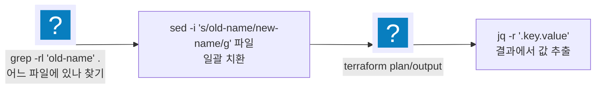

import { Quiz, QuizResults } from 'starlight-quiz/components';
import { Steps, LinkButton } from '@astrojs/starlight/components';

> 문서 유형: explanation

## ① 학습 목표

- [ ] grep으로 디렉터리 전체에서 문자열/파일을 찾을 수 있다 (`-r`, `-l`)
- [ ] sed로 파일 내용을 제자리 치환할 수 있다 (`-i`)
- [ ] jq로 JSON에서 값을 뽑을 수 있다 (`.key`, `-r`)
- [ ] heredoc/파이프/리다이렉트를 쓸 수 있고, PowerShell과의 차이를 안다

## ② 핵심 개념



| 명령                        | 핵심 사용법                          |
| ------------------------- | ------------------------------- |
| `grep -r "패턴" .`          | 현재 디렉터리 전체에서 검색 (매칭 줄 출력)       |
| `grep -rl "패턴" .`         | 매칭된 **파일명만** 출력 → sed에 넘기기 좋음   |
| `sed -i 's/old/new/g' 파일` | 파일 안 old를 전부 new로 **제자리 치환**    |
| `jq '.key'`               | JSON에서 key 값 추출 (따옴표 포함)        |
| `jq -r '.key'`            | **raw 출력** (따옴표 제거) — 변수 대입·비교용 |
| `cmd1 \| cmd2`            | 파이프: 앞 출력 → 뒤 입력                |
| `> f` / `>> f`            | 덮어쓰기 / 이어쓰기 리다이렉트               |

heredoc — 여러 줄을 파일/명령에 넣기:

```bash
cat > main.tf <<'EOF'
resource "aws_vpc" "main" {
  cidr_block = "10.0.0.0/16"
}
EOF
```

`<<'EOF'`(따옴표)면 `$` 그대로, `<<EOF`면 변수 확장 — 헷갈리면 따옴표 붙이는 게 안전.

:::caution[PowerShell 함정 (본 PC가 Windows일 때)]
- `curl`은 Invoke-WebRequest 별칭 → 진짜 curl은 **`curl.exe`**
- `$` 포함 문자열(비밀번호 등)은 **작은따옴표** `'pa$$word'`
- **PowerShell 7 필수** — 5.1은 CP949 인코딩이라 jq/terraform 출력이 깨짐
- sed/grep은 PowerShell에 없음 → Git Bash 또는 CloudShell에서 실행
:::

## ③ 대회에서 어떻게 쓰이나

- **30% 변동 드릴(PART-6 모듈 15)이 전부 grep/sed다**: 과제지가 리소스 이름·CIDR·태그를 바꿔서 나오면, 받은 코드에서 `grep -rl`로 위치를 찾고 `sed -i`로 일괄 치환하는 속도가 곧 시간 점수다.
- **채점은 jq 파싱이다**: 채점 스크립트(mark.sh)는 aws cli 출력을 jq로 파싱한다. jq를 읽을 줄 알아야 "무엇을 채점하는지" 역추적할 수 있다.

## ④ 미니 실습 (20분, 과금 없음 — 로컬/Git Bash)

<Steps>

1. **샘플 tf 파일 만들고 이름 일괄 치환**

   ```bash
   mkdir -p /tmp/drill && cd /tmp/drill
   cat > vpc.tf <<'EOF'
   resource "aws_vpc" "skills_vpc" {
     cidr_block = "10.0.0.0/16"
     tags = { Name = "skills-vpc" }
   }
   EOF
   grep -rl "skills" .                 # 어느 파일에 있는지
   sed -i 's/skills/contest/g' vpc.tf  # 일괄 치환
   grep -n "contest" vpc.tf            # 3곳 바뀌었는지 확인
   ```

2. **`terraform output -json`을 가정한 jq 추출**

   ```bash
   cat > out.json <<'EOF'
   { "vpc_id": { "value": "vpc-0abc123" }, "subnet_ids": { "value": ["subnet-1", "subnet-2"] } }
   EOF
   jq '.vpc_id.value' out.json          # "vpc-0abc123" (따옴표 있음)
   jq -r '.vpc_id.value' out.json       # vpc-0abc123  (raw)
   jq -r '.subnet_ids.value[0]' out.json  # subnet-1
   ```

3. **정리**: `rm -rf /tmp/drill`

</Steps>

## ⑤ 자기 점검 퀴즈

<Quiz title="파일 목록만 뽑는 grep 옵션">
디렉터리 전체에서 `old-name` 이 들어 있는 **파일 목록만** 출력하는 명령은 grep -[[rl]] "old-name" . 이다. (빈칸에는 하이픈을 뺀 옵션 문자 두 개를 붙여 쓴다)

---

`-r`은 하위 디렉터리까지 재귀 검색, `-l`은 매칭된 **파일명만** 출력한다(매칭 줄은 안 보여 줌). 30% 변동 드릴의 표준 콤보가 여기서 나온다 — `grep -rl` 로 바꿀 파일을 찾고, `sed -i 's/old-name/new-name/g'` 로 일괄 치환한다. `-l` 없이 `grep -r` 만 쓰면 매칭 줄이 쏟아져 파일 목록을 눈으로 골라야 한다.
</Quiz>

<Quiz title="jq의 -r 옵션">
`jq '.a'` 와 `jq -r '.a'` 의 출력 차이는? 셸 변수에 넣을 때는 어느 쪽인가?

- [x] 전자는 `"값"`(따옴표 포함), 후자는 `값`(raw). 변수 대입·문자열 비교에는 `-r`
- [ ] `-r`은 recursive(재귀) 탐색 옵션이라 중첩 JSON을 끝까지 훑는 것이고, 따옴표와는 무관하다
  > `-r`은 **raw output**이다. grep·sed의 `-r`(recursive/regex)과 이름만 같고 의미가 전혀 다르다 — 가장 흔한 착각.
- [ ] 전자가 raw이고 후자가 따옴표를 붙인다. 변수 대입에는 옵션 없는 쪽
  > 정확히 반대다. 기본 출력이 JSON 문자열(따옴표 포함)이고, `-r`이 그 껍질을 벗긴다.
- [ ] 둘 다 출력이 같으며 `-r`은 여러 줄 결과를 한 줄로 합칠 뿐이다

jq의 기본 출력은 **JSON 값**이라 문자열이면 따옴표가 붙는다. `-r`(raw)을 붙이면 따옴표가 사라진다. `VPC_ID=$(terraform output -json | jq -r '.vpc_id.value')` 처럼 변수에 담거나 문자열 비교를 할 때 `-r`을 빠뜨리면 값에 `"` 가 섞여 들어가 이후 비교·명령이 전부 어긋난다.
</Quiz>

<Quiz title="PowerShell의 curl 함정">
Windows PowerShell에서 `curl http://...` 이 기대와 다르게 동작하는 이유와 해결책은?

- [x] `curl`이 `Invoke-WebRequest`의 별칭이기 때문. 진짜 curl은 `curl.exe`로 실행한다
- [ ] PowerShell 5.1의 CP949 인코딩 때문. PowerShell 7로 올리면 해결된다
  > CP949 인코딩 문제는 **실재하지만 다른 증상**이다(jq·terraform 출력 깨짐). PowerShell 7에서도 `curl` 별칭은 그대로 살아 있다.
- [ ] PowerShell에는 curl이 아예 없어서 명령을 못 찾는 것. Git Bash에서 실행한다
  > "없어서 실패"가 아니라 "**있는데 다른 것**이라 실패"다. 그래서 에러 없이 엉뚱한 객체가 나와 더 헷갈린다.
- [ ] curl이 관리자 권한을 요구하기 때문. 관리자 셸에서 실행한다

PowerShell은 `curl`·`wget`을 각각 `Invoke-WebRequest`의 별칭으로 잡아 두었다. 문법도 출력도 다르므로 `-H`, `-d` 같은 curl 플래그가 통하지 않는다. **`curl.exe`** 로 명시하면 진짜 curl이 실행된다. 함께 기억할 PowerShell 함정: `$` 포함 문자열은 작은따옴표(`'pa$$word'`), PowerShell 7 필수(5.1은 CP949로 출력이 깨짐), `sed`/`grep`은 없으므로 Git Bash나 CloudShell에서 실행.
</Quiz>

<QuizResults confetti />

## ⑥ 다음 단계

모듈 15(30% 변동 드릴)이 이 grep/sed 콤보를 시간 점수로 환산한다.

<LinkButton href="/start/awscli-basics/" icon="right-arrow">다음 선수 학습 — AWS CLI 기초</LinkButton>
<LinkButton href="/part-6/15-mutation-drill/" variant="minimal">PART 6 — Battle Drills</LinkButton>

## 공식 문서

- [GNU grep 매뉴얼](https://www.gnu.org/software/grep/manual/grep.html) — 재귀 검색·정규식 옵션
- [GNU sed 매뉴얼](https://www.gnu.org/software/sed/manual/sed.html) — 치환 표현식
- [jq 매뉴얼](https://jqlang.github.io/jq/manual/) — JSON 필터
- [PowerShell 문서](https://learn.microsoft.com/powershell/scripting/) — 대회 환경 셸(문자열 치환·인코딩)
