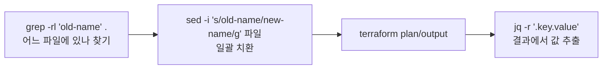

> 문서 유형: explanation

## ① 학습 목표

- [ ] grep으로 디렉터리 전체에서 문자열/파일을 찾을 수 있다 (`-r`, `-l`)
- [ ] sed로 파일 내용을 제자리 치환할 수 있다 (`-i`)
- [ ] jq로 JSON에서 값을 뽑을 수 있다 (`.key`, `-r`)
- [ ] heredoc/파이프/리다이렉트를 쓸 수 있고, PowerShell과의 차이를 안다

## ② 핵심 개념



| 명령                        | 핵심 사용법                          |
| ------------------------- | ------------------------------- |
| `grep -r "패턴" .`          | 현재 디렉터리 전체에서 검색 (매칭 줄 출력)       |
| `grep -rl "패턴" .`         | 매칭된 **파일명만** 출력 → sed에 넘기기 좋음   |
| `sed -i 's/old/new/g' 파일` | 파일 안 old를 전부 new로 **제자리 치환**    |
| `jq '.key'`               | JSON에서 key 값 추출 (따옴표 포함)        |
| `jq -r '.key'`            | **raw 출력** (따옴표 제거) — 변수 대입·비교용 |
| `cmd1 \| cmd2`            | 파이프: 앞 출력 → 뒤 입력                |
| `> f` / `>> f`            | 덮어쓰기 / 이어쓰기 리다이렉트               |

heredoc — 여러 줄을 파일/명령에 넣기:

```bash
cat > main.tf <<'EOF'
resource "aws_vpc" "main" {
  cidr_block = "10.0.0.0/16"
}
EOF
```

`<<'EOF'`(따옴표)면 `$` 그대로, `<<EOF`면 변수 확장 — 헷갈리면 따옴표 붙이는 게 안전.

**PowerShell 차이 (본 PC가 Windows일 때 함정)**:

- `curl`은 Invoke-WebRequest 별칭 → 진짜 curl은 **`curl.exe`**
- `$` 포함 문자열(비밀번호 등)은 **작은따옴표** `'pa$$word'`
- **PowerShell 7 필수** — 5.1은 CP949 인코딩이라 jq/terraform 출력이 깨짐
- sed/grep은 PowerShell에 없음 → Git Bash 또는 CloudShell에서 실행

## ③ 대회에서 어떻게 쓰이나

- **30% 변동 드릴(PART-5 모듈 11)이 전부 grep/sed다**: 과제지가 리소스 이름·CIDR·태그를 바꿔서 나오면, 받은 코드에서 `grep -rl`로 위치를 찾고 `sed -i`로 일괄 치환하는 속도가 곧 시간 점수다.
- **채점은 jq 파싱이다**: 채점 스크립트(mark.sh)는 aws cli 출력을 jq로 파싱한다. jq를 읽을 줄 알아야 "무엇을 채점하는지" 역추적할 수 있다.

## ④ 미니 실습 (20분, 과금 없음 — 로컬/Git Bash)

1. 샘플 tf 파일 만들고 이름 일괄 치환:

```bash
mkdir -p /tmp/drill && cd /tmp/drill
cat > vpc.tf <<'EOF'
resource "aws_vpc" "skills_vpc" {
  cidr_block = "10.0.0.0/16"
  tags = { Name = "skills-vpc" }
}
EOF
grep -rl "skills" .                 # 어느 파일에 있는지
sed -i 's/skills/contest/g' vpc.tf  # 일괄 치환
grep -n "contest" vpc.tf            # 3곳 바뀌었는지 확인
```

2. `terraform output -json`을 가정한 jq 추출:

```bash
cat > out.json <<'EOF'
{ "vpc_id": { "value": "vpc-0abc123" }, "subnet_ids": { "value": ["subnet-1", "subnet-2"] } }
EOF
jq '.vpc_id.value' out.json          # "vpc-0abc123" (따옴표 있음)
jq -r '.vpc_id.value' out.json       # vpc-0abc123  (raw)
jq -r '.subnet_ids.value[0]' out.json  # subnet-1
```

3. 정리: `rm -rf /tmp/drill`

## ⑤ 자기 점검 퀴즈

1. 디렉터리 전체에서 `old-name`이 들어있는 **파일 목록만** 얻는 명령은?
2. `jq '.a'`와 `jq -r '.a'`의 출력 차이는? 셸 변수에 넣을 때는 어느 쪽?
3. PowerShell에서 `curl http://...`이 이상하게 동작하는 이유와 해결책은?

<details>
<summary>정답</summary>

1. `grep -rl "old-name" .`
2. 전자는 `"값"`(따옴표 포함), 후자는 `값`(raw). 변수 대입·문자열 비교에는 `-r`.
3. `curl`이 Invoke-WebRequest 별칭이기 때문. `curl.exe`로 실행.

</details>

## ⑥ 다음 단계

- [../PART-5-Battle-Drills/](/part-5/11-mutation-drill/) — 모듈 11 30% 변동 드릴
- 다음 선수 학습: [awscli-basics.md](/start/awscli-basics/)

## 공식 문서

- [GNU grep 매뉴얼](https://www.gnu.org/software/grep/manual/grep.html) — 재귀 검색·정규식 옵션
- [GNU sed 매뉴얼](https://www.gnu.org/software/sed/manual/sed.html) — 치환 표현식
- [jq 매뉴얼](https://jqlang.github.io/jq/manual/) — JSON 필터
- [PowerShell 문서](https://learn.microsoft.com/powershell/scripting/) — 대회 환경 셸(문자열 치환·인코딩)
