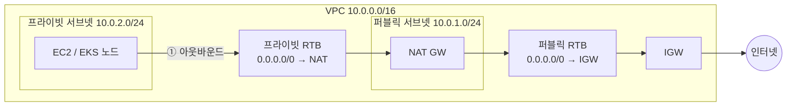

import { Quiz, QuizResults } from 'starlight-quiz/components';

> 문서 유형: explanation

## ① 학습 목표

- [ ] VPC/서브넷/IGW/NAT GW/라우팅 테이블의 역할을 한 문장씩 설명할 수 있다
- [ ] 퍼블릭 서브넷과 프라이빗 서브넷의 차이를 **라우팅 테이블 기준**으로 구분할 수 있다
- [ ] 프라이빗 서브넷의 인스턴스가 인터넷으로 나가는 경로를 그릴 수 있다
- [ ] SG와 NACL의 차이(스테이트풀 vs 스테이트리스)를 안다

## ② 핵심 개념

| 용어 | 한 줄 정의 |
|---|---|
| VPC | AWS 안의 격리된 가상 네트워크 (CIDR 예: `10.0.0.0/16`) |
| 서브넷 | VPC를 쪼갠 조각. AZ 하나에 속함 (예: `10.0.1.0/24`) |
| IGW (인터넷 게이트웨이) | VPC ↔ 인터넷 양방향 관문. VPC당 1개 |
| NAT GW | 프라이빗 서브넷의 **아웃바운드 전용** 관문. 퍼블릭 서브넷에 위치. **시간당 과금** |
| 라우팅 테이블(RTB) | "목적지 → 어디로 보낼지" 규칙표. **서브넷에 연결(association)** |
| SG (보안 그룹) | 인스턴스 단위 방화벽. **스테이트풀** — 나간 트래픽의 응답은 자동 허용 |
| NACL | 서브넷 단위 방화벽. **스테이트리스** — 인바운드/아웃바운드 각각 규칙 필요 |

**서브넷이 퍼블릭인지 결정하는 것은 이름이 아니라 라우팅 테이블(RTB)이다:**

- 퍼블릭 서브넷 = 연결된 RTB에 `0.0.0.0/0 → IGW` 경로가 있는 서브넷
- 프라이빗 서브넷 = `0.0.0.0/0 → NAT GW` (또는 인터넷 경로 없음)

트래픽 경로 암기: **프라이빗 인스턴스 → (프라이빗 RTB) → NAT GW → (퍼블릭 RTB) → IGW → 인터넷**. 역방향(인터넷 → 프라이빗)은 NAT를 통해 들어올 수 없다.

## ③ 대회에서 어떻게 쓰이나

- **RTB ↔ 서브넷 매핑이 채점 대상이다.** 서브넷을 만들고 RTB 연결을 빠뜨리면 "이름은 private인데 실제로는 메인 RTB를 타는" 서브넷이 되고, 채점 스크립트(mark.sh)는 라우팅 실체를 본다.
- EKS 노드는 프라이빗 서브넷에 배치되므로 NAT 경로가 없으면 이미지 pull부터 실패한다.
- 이 내용은 **PART-1 모듈 01(Terraform VPC)** 의 직접적인 기반 — 여기서 콘솔로 손에 익힌 구조를 모듈 01에서 코드로 다시 만든다.

## ④ 미니 실습 (콘솔, 30분)

> ⚠️ NAT GW는 **시간당 + 데이터 과금**. 실습 끝나면 즉시 삭제한다.

1. VPC 생성: `10.0.0.0/16` (VPC만 생성, "VPC 등" 마법사 말고 수동으로)
2. 서브넷 2개: `10.0.1.0/24` (public 용), `10.0.2.0/24` (private 용) — 같은 AZ
3. IGW 생성 → VPC에 연결(Attach)
4. NAT GW 생성 → **퍼블릭 서브넷**에, 탄력적 IP 새로 할당
5. RTB 2개 생성:
   - public-rtb: `0.0.0.0/0 → IGW`, 서브넷 `10.0.1.0/24` 연결
   - private-rtb: `0.0.0.0/0 → NAT GW`, 서브넷 `10.0.2.0/24` 연결
6. 각 서브넷 상세에서 "라우팅 테이블" 탭을 열어 매핑을 눈으로 확인
7. **즉시 삭제 (순서 중요)**: NAT GW 삭제 → 탄력적 IP 릴리스 → IGW 분리·삭제 → 서브넷 → RTB → VPC

## ⑤ 자기 점검 퀴즈

<Quiz title="퍼블릭 서브넷의 판정 기준">
서브넷이 "퍼블릭"이 되는 정확한 조건은?

- [x] 연결된 라우팅 테이블에 `0.0.0.0/0 → IGW` 경로가 있다
- [ ] 서브넷의 "퍼블릭 IPv4 주소 자동 할당" 옵션이 켜져 있다
  > 인스턴스가 공인 IP를 받기만 할 뿐이다. RTB에 IGW 경로가 없으면 그 공인 IP로는 아무 통신도 되지 않는다.
- [ ] VPC에 IGW가 연결(attach)되어 있다
  > IGW attach는 VPC 전체의 전제 조건일 뿐이다. 같은 VPC 안에서도 서브넷마다 연결된 RTB에 따라 퍼블릭/프라이빗이 갈린다.
- [ ] 서브넷에 붙은 NACL이 인바운드 `0.0.0.0/0` 을 허용한다

퍼블릭/프라이빗을 가르는 것은 **이름도, IP 설정도, 방화벽도 아니라 연결된 RTB의 기본 경로**다. `0.0.0.0/0 → IGW` 면 퍼블릭, `0.0.0.0/0 → NAT GW`(또는 인터넷 경로 없음)면 프라이빗. 자동 퍼블릭 IP 할당 설정은 부차적이다. 채점 스크립트(mark.sh)도 서브넷 이름이 아니라 라우팅 실체를 본다.
</Quiz>

<Quiz title="프라이빗 서브넷의 아웃바운드 경로">
프라이빗 서브넷의 EC2가 `yum update`를 실행할 때, 트래픽이 거치는 올바른 순서는?

- [x] EC2 → 프라이빗 RTB → NAT GW(퍼블릭 서브넷) → 퍼블릭 RTB → IGW → 인터넷
- [ ] EC2 → 프라이빗 RTB → IGW → NAT GW → 인터넷
  > IGW가 NAT보다 앞에 올 수 없다. 프라이빗 RTB의 기본 경로는 IGW가 아니라 NAT GW를 가리킨다.
- [ ] EC2 → NAT GW → 프라이빗 RTB → 퍼블릭 RTB → 인터넷
- [ ] EC2 → 퍼블릭 RTB → NAT GW → IGW → 인터넷
  > EC2가 처음 타는 RTB는 **자기 서브넷에 연결된** 프라이빗 RTB다. 퍼블릭 RTB는 NAT GW가 있는 서브넷의 것이다.

**프라이빗 인스턴스 → (프라이빗 RTB) → NAT GW → (퍼블릭 RTB) → IGW → 인터넷.** RTB를 두 번 거친다는 점이 핵심이다 — 한 번은 EC2 서브넷의 RTB, 한 번은 NAT GW가 놓인 퍼블릭 서브넷의 RTB. 역방향(인터넷 → 프라이빗)은 NAT를 통해 들어올 수 없다.
</Quiz>

<Quiz title="SG vs NACL — 응답 트래픽">
아웃바운드 443을 허용한 상태에서 응답 트래픽이 돌아오게 하려면? 옳은 것을 **모두** 고르시오.

- [x] SG는 스테이트풀이므로 별도의 인바운드 규칙이 필요 없다
- [x] NACL은 스테이트리스이므로 인바운드 임시 포트(1024-65535) 허용 규칙이 따로 필요하다
- [ ] SG에도 인바운드 443 허용 규칙을 추가해야 응답이 들어온다
  > 응답 트래픽의 목적지 포트는 443이 아니라 클라이언트의 임시 포트다. 게다가 SG는 스테이트풀이라 규칙 자체가 불필요하다.
- [ ] NACL도 연결 상태를 추적하므로 아웃바운드 규칙 하나로 충분하다
  > 스테이트풀은 SG만이다. NACL은 인바운드/아웃바운드를 각각 독립적으로 평가한다.

SG = **스테이트풀**(나간 트래픽의 응답은 자동 허용), NACL = **스테이트리스**(양방향 규칙을 각각 작성). NACL을 손댔다면 인바운드 임시 포트 범위 1024-65535를 허용했는지 반드시 확인한다.
</Quiz>

<QuizResults confetti />

## ⑥ 다음 단계

- [PART 1 — Foundation·IaC](/part-1/01-terraform-vpc/) — 모듈 01에서 이 구조를 Terraform으로 재현
- 다음 선수 학습: [IAM 기초](/start/iam-basics/)

## 공식 문서

- [Amazon VPC 사용 설명서](https://docs.aws.amazon.com/vpc/latest/userguide/) — 서브넷·라우팅·NAT 원문
- [보안 그룹](https://docs.aws.amazon.com/vpc/latest/userguide/vpc-security-groups.html) — 스테이트풀 동작과 규칙 형식
- [VPC 엔드포인트](https://docs.aws.amazon.com/vpc/latest/privatelink/concepts.html) — 프라이빗 환경에서의 AWS API 접근
