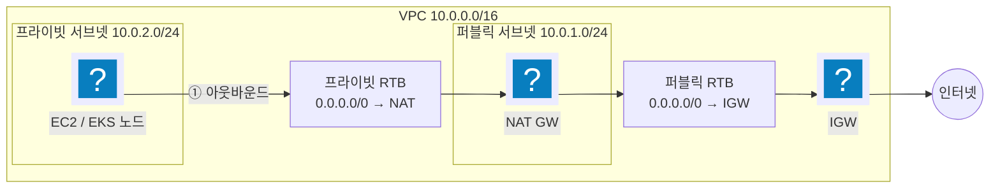
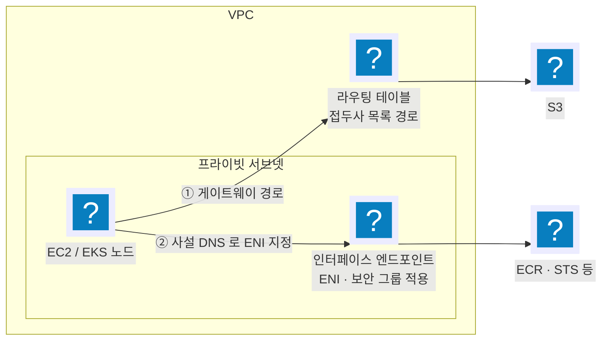

import { Quiz, QuizResults } from 'starlight-quiz/components';
import { Steps, LinkButton } from '@astrojs/starlight/components';

> 문서 유형: explanation

## ① 학습 목표

- [ ] VPC/서브넷/IGW/NAT GW/라우팅 테이블의 역할을 한 문장씩 설명할 수 있다
- [ ] 퍼블릭 서브넷과 프라이빗 서브넷의 차이를 **라우팅 테이블 기준**으로 구분할 수 있다
- [ ] 프라이빗 서브넷의 인스턴스가 인터넷으로 나가는 경로를 그릴 수 있다
- [ ] SG와 NACL의 차이(스테이트풀 vs 스테이트리스)를 안다

## ② 핵심 개념

| 용어 | 한 줄 정의 |
|---|---|
| VPC | AWS 안의 격리된 가상 네트워크 (CIDR 예: `10.0.0.0/16`) |
| 서브넷 | VPC를 쪼갠 조각. AZ 하나에 속함 (예: `10.0.1.0/24`) |
| IGW (인터넷 게이트웨이) | VPC ↔ 인터넷 양방향 관문. VPC당 1개 |
| NAT GW | 프라이빗 서브넷의 **아웃바운드 전용** 관문. 퍼블릭 서브넷에 위치. **시간당 과금** |
| 라우팅 테이블(RTB) | "목적지 → 어디로 보낼지" 규칙표. **서브넷에 연결(association)** |
| SG (보안 그룹) | 인스턴스 단위 방화벽. **스테이트풀** — 나간 트래픽의 응답은 자동 허용 |
| NACL | 서브넷 단위 방화벽. **스테이트리스** — 인바운드/아웃바운드 각각 규칙 필요 |

**서브넷이 퍼블릭인지 결정하는 것은 이름이 아니라 라우팅 테이블(RTB)이다:**

- 퍼블릭 서브넷 = 연결된 RTB에 `0.0.0.0/0 → IGW` 경로가 있는 서브넷
- 프라이빗 서브넷 = `0.0.0.0/0 → NAT GW` (또는 인터넷 경로 없음)



트래픽 경로 암기: **프라이빗 인스턴스 → (프라이빗 RTB) → NAT GW → (퍼블릭 RTB) → IGW → 인터넷**. 역방향(인터넷 → 프라이빗)은 NAT를 통해 들어올 수 없다.

## ③ 대회에서 어떻게 쓰이나

:::danger[채점 함정 — RTB ↔ 서브넷 매핑]
서브넷을 만들고 RTB 연결(association)을 빠뜨리면 "이름은 private인데 실제로는 메인 RTB를 타는" 서브넷이 된다. 채점 스크립트(mark.sh)는 이름이 아니라 **라우팅 실체**를 본다.
:::

- EKS 노드는 프라이빗 서브넷에 배치되므로 NAT 경로가 없으면 이미지 pull부터 실패한다.
- 이 내용은 **PART-1 모듈 01(Terraform VPC)** 의 직접적인 기반 — 여기서 콘솔로 손에 익힌 구조를 모듈 01에서 코드로 다시 만든다.

## ④ 미니 실습 (콘솔, 30분)

:::caution[과금 주의]
NAT GW는 **시간당 + 데이터 과금**. 실습 끝나면 즉시 삭제한다.
:::

<Steps>

1. **VPC 생성**: `10.0.0.0/16` (VPC만 생성, "VPC 등" 마법사 말고 수동으로)

2. **서브넷 2개**: `10.0.1.0/24` (public 용), `10.0.2.0/24` (private 용) — 같은 AZ

3. **IGW 생성** → VPC에 연결(Attach)

4. **NAT GW 생성** → **퍼블릭 서브넷**에, 탄력적 IP 새로 할당

5. **RTB 2개 생성**

   - public-rtb: `0.0.0.0/0 → IGW`, 서브넷 `10.0.1.0/24` 연결
   - private-rtb: `0.0.0.0/0 → NAT GW`, 서브넷 `10.0.2.0/24` 연결

6. **매핑 확인**: 각 서브넷 상세에서 "라우팅 테이블" 탭을 열어 눈으로 확인

7. **즉시 삭제 (순서 중요)**

   NAT GW 삭제 → 탄력적 IP 릴리스 → IGW 분리·삭제 → 서브넷 → RTB → VPC

</Steps>

## ⑤ 심화 개념 (응용력 기르기)

### 보안 그룹과 NACL — 판정 방식이 다르다

| 항목 | 보안 그룹(SG) | NACL |
|---|---|---|
| 적용 지점 | ENI(인스턴스) | 서브넷 |
| 상태 추적 | 스테이트풀 — 나간 트래픽의 응답은 자동 허용 | 스테이트리스 — 인바운드·아웃바운드를 각각 평가 |
| 규칙 종류 | 허용만 | 허용과 거부 둘 다 |
| 평가 방식 | 모든 규칙을 합쳐서 한 번에, 하나라도 맞으면 허용 | **규칙 번호 오름차순**, 처음 맞는 규칙에서 판정 종료 |
| 기본값 | 직접 만든 SG는 인바운드 전부 거부·아웃바운드 전부 허용 (VPC 기본 SG는 같은 SG 소속끼리의 인바운드가 열려 있다) | 기본 NACL은 양방향 전부 허용 |

NACL의 번호 순서 평가가 함정이다. 100번에 `0.0.0.0/0 ALLOW`, 200번에 `1.2.3.4/32 DENY` 를 넣으면 **거부는 영영 적용되지 않는다** — 100번에서 판정이 끝나기 때문이다. 거부 규칙은 항상 더 낮은 번호에 둔다.

SG는 규칙의 대상으로 **다른 SG를 지정**할 수 있다. `ALB의 SG 에서 오는 8080` 같은 규칙은 IP가 바뀌어도 그대로 산다. 대회에서 계층 간 통신을 여는 표준 방식이다.

### 프리픽스 리스트 — CIDR 묶음 하나를 규칙의 소스로 쓴다

프리픽스 리스트는 CIDR 여러 개에 이름을 붙인 묶음이고, ID 는 `pl-` 로 시작한다. 종류가 둘이다.

| 종류 | 만드는 주체 | 쓰임 |
|---|---|---|
| 고객 관리형 | 사용자 | 사내 대역 등 자주 쓰는 CIDR 묶음을 한 번 정의해 여러 SG·RTB 에서 참조 |
| AWS 관리형 | AWS | S3·CloudFront·VPC Lattice 같은 서비스의 대역. 대역이 바뀌어도 규칙은 그대로 |

AWS 관리형 프리픽스 리스트의 ID 는 **계정·리전마다 다르다**. 문서에서 본 값을 그대로 쓰지 않고 조회해서 쓴다.

```bash
aws ec2 describe-managed-prefix-lists --region ap-northeast-1 \
  --filters Name=prefix-list-name,Values=com.amazonaws.ap-northeast-1.vpc-lattice \
  --query 'PrefixLists[0].PrefixListId' --output text
# 기대: pl-... (계정·리전마다 값이 다르다)
```

CLI 로 SG 규칙을 넣을 때 프리픽스 리스트는 `--cidr` 로 지정할 수 없다. `--ip-permissions` 구조 안의 `PrefixListIds` 로만 받는다.

```bash
aws ec2 authorize-security-group-ingress --group-id sg-... \
  --ip-permissions 'IpProtocol=tcp,FromPort=8080,ToPort=8080,PrefixListIds=[{PrefixListId=pl-...}]'
```

특정 서비스에서 오는 트래픽만 열라는 요구는 `0.0.0.0/0` 으로 열면 통신은 되지만 채점은 미충족이다. 관리형 프리픽스 리스트를 소스로 지정해야 충족한다.

### 라우팅 테이블 조회 — 가장 긴 접두사가 이긴다

라우팅 테이블에 여러 경로가 겹치면 **가장 구체적인(접두사가 긴) 경로**가 선택된다. 우선순위 필드나 규칙 순서는 없다.

| 목적지 | 대상 | `10.0.5.20` 행 요청에 선택되는 경로 |
|---|---|---|
| `0.0.0.0/0` | IGW | |
| `10.0.0.0/16` | local | |
| `10.0.5.0/24` | NAT GW | **선택** — 접두사가 가장 길다 |

세 번째 줄처럼 **`local` 보다 구체적인 경로**를 넣을 때는 제약이 둘 붙는다. 목적지가 VPC 안 어느 서브넷의 CIDR 과 정확히 일치해야 하고, 대상은 **NAT 게이트웨이·네트워크 인터페이스·Gateway Load Balancer 엔드포인트** 셋 중 하나여야 한다. 인터넷 게이트웨이나 Transit Gateway 를 이 자리에 넣으면 경로 생성이 거부된다.

VPC CIDR에 대한 `local` 경로는 자동 생성되며 **지울 수 없다**. 다만 대상 교체는 지원된다 — `aws ec2 replace-route --destination-cidr-block 10.0.0.0/16 --network-interface-id eni-...` 로 VPC 내부 트래픽을 검사용 어플라이언스로 몰고, `--local-target` 으로 되돌린다. 미들박스 검사 구성이 이 방식이다.

### VPC 연결 — 피어링과 Transit Gateway

- **VPC 피어링**: VPC 두 개를 1:1로 잇는다. **전이(transitive) 라우팅이 없다** — A↔B, B↔C가 있어도 A는 C에 닿지 못한다. VPC가 n개면 연결이 `n(n-1)/2` 개로 늘어난다.
- **Transit Gateway(TGW)**: 허브 하나에 VPC·VPN·Direct Connect를 스포크로 붙인다. 연결이 n개로 끝나고, 라우팅 테이블을 TGW 쪽에서 나눠 스포크 간 통신을 선택적으로 허용한다.

양쪽 다 **CIDR이 겹치면 통신이 성립하지 않는다**. 다만 막히는 지점이 다르다 — 피어링은 연결 생성 자체가 거부되고, TGW 는 어태치먼트가 만들어지되 그 VPC 의 경로가 TGW 라우팅 테이블에 전파되지 않는다. 어느 쪽이든 결과는 같으므로 VPC를 여러 개 설계할 때 CIDR을 미리 갈라 둔다.

### 연결 방식이 무엇을 보고 판단하는가 — L3·L4·L7

연결 방식을 고를 때 기준은 **트래픽의 어느 부분까지 보고 목적지를 정하느냐**다.

| 계층 | 판단 근거 | 이 대역에서 쓰는 것 |
|---|---|---|
| L3 | 목적지 IP 주소와 CIDR | 라우팅 테이블, VPC 피어링, Transit Gateway |
| L4 | TCP/UDP 포트까지 | NLB, PrivateLink 엔드포인트 서비스 |
| L7 | HTTP 메서드·경로·헤더까지 | ALB 리스너 규칙, CloudFront 동작, VPC Lattice |

L3 로 잇는 방식은 두 VPC 사이에 **IP 경로 자체를 만든다**. 그래서 CIDR 이 겹치면 목적지를 하나로 정할 수 없어 막힌다. L7 로 잇는 방식은 클라이언트가 IP 대신 DNS 이름을 호출하고 중간의 프록시가 목적지를 고르므로 CIDR 이 겹쳐도 무방하다.

**VPC Lattice** 는 서비스 네트워크 하나에 VPC·서비스를 붙여 다대다로 잇는 L7 방식이다. 피어링·TGW·PrivateLink 와 무엇이 어떻게 다른지, Service Network·Service·Target Group·Listener 4계층이 각각 무엇인지는 [VPC Lattice 이론](/part-4/12-vpc-lattice/theory/)에서 다룬다.

### VPC 엔드포인트 — 프라이빗 경로로 AWS API 부르기

프라이빗 서브넷에서 S3를 호출하면 기본적으로 NAT GW를 거쳐 인터넷으로 나갔다 들어온다. VPC 엔드포인트는 그 경로를 VPC 안에서 끝낸다.



| 항목 | 게이트웨이 엔드포인트 | 인터페이스 엔드포인트 |
|---|---|---|
| 대상 서비스 | S3, DynamoDB **둘뿐** | 대부분의 AWS 서비스 |
| 동작 방식 | 라우팅 테이블에 접두사 목록 경로 추가 | 서브넷에 ENI를 만들고 사설 DNS로 가로챈다 |
| 보안 그룹 | 적용되지 않는다 | **적용된다** — 열지 않으면 막힌다 |
| 접근 제어 | 엔드포인트 정책 | 엔드포인트 정책 + 보안 그룹 |
| 요금 | 무료 | 시간당 + 데이터 처리 과금 |
| 온프레미스에서 접근 | 불가 | 가능(PrivateLink 기반) |

프라이빗 클러스터를 만들 때 인터페이스 엔드포인트의 보안 그룹에 443을 열지 않아 노드가 ECR·STS에 닿지 못하는 사고가 흔하다. **게이트웨이 엔드포인트는 라우팅 문제, 인터페이스 엔드포인트는 보안 그룹 문제**로 나뉜다고 기억한다.

### IGW와 NAT GW

| 항목 | 인터넷 게이트웨이(IGW) | NAT 게이트웨이 |
|---|---|---|
| 방향 | 양방향 | 아웃바운드 전용 |
| 주소 변환 | 공인 IP를 가진 인스턴스의 1:1 변환 | 여러 사설 IP를 탄력적 IP 하나로 다중화 |
| 위치 | VPC에 연결 | **퍼블릭 서브넷 안**에 배치 |
| 요금 | 무료 | 시간당 + 데이터 처리 과금 |
| 가용성 | VPC 단위, 관리 불필요 | **AZ 단위** — AZ마다 하나 두지 않으면 그 AZ 장애 시 단절 |

NAT GW를 AZ 하나에만 두면 요금은 아끼지만, 그 AZ가 죽을 때 다른 AZ의 프라이빗 서브넷도 함께 인터넷을 잃는다. 실습에서는 하나로 충분하고, 실무 설계 질문에서는 AZ마다 두는 것이 정답이다.

### DNS — Route 53 Resolver와 프라이빗 호스팅 영역

VPC 안의 인스턴스는 `VPC CIDR의 두 번째 주소`(예: `10.0.0.2`)를 네임서버로 받는다. 이것이 Route 53 Resolver다. 질의는 순서대로 풀린다.

1. VPC에 연결된 **프라이빗 호스팅 영역**의 레코드
2. 인터페이스 엔드포인트의 사설 DNS(활성화한 경우)
3. 퍼블릭 DNS

VPC 속성 `enableDnsSupport`(Resolver 사용)와 `enableDnsHostnames`(DNS 이름 부여)가 **둘 다 켜져 있어야** 프라이빗 호스팅 영역과 엔드포인트의 사설 DNS가 동작한다. 프라이빗 클러스터에서 엔드포인트 이름이 공인 IP로 풀린다면 이 두 속성을 먼저 확인한다.

### 트러블슈팅 사례

| 증상 | 원인 | 확인·대응 |
|---|---|---|
| 이름이 private인 서브넷이 인터넷에 직접 나간다 | RTB 연결(association) 누락으로 메인 RTB를 탄다 | 서브넷 상세의 라우팅 테이블 탭 확인 |
| NACL을 손댄 뒤 응답이 끊긴다 | 인바운드 임시 포트(1024-65535) 미허용 | NACL 인바운드 규칙 추가 |
| NACL 거부 규칙이 먹지 않는다 | 더 낮은 번호의 허용 규칙에서 판정이 끝난다 | 거부 규칙을 더 낮은 번호로 옮긴다 |
| 피어링을 걸었는데 3번째 VPC에 못 닿는다 | 피어링은 전이 라우팅을 하지 않는다 | 직접 피어링을 추가하거나 TGW로 전환 |
| 프라이빗 서브넷에서 ECR pull 실패 | 인터페이스 엔드포인트 보안 그룹이 443을 막는다 | 엔드포인트 SG 인바운드 확인 |
| S3 게이트웨이 엔드포인트가 동작하지 않는다 | 해당 서브넷의 RTB에 엔드포인트 경로 미연결 | 엔드포인트 생성 시 선택한 RTB 목록 확인 |
| 프라이빗 호스팅 영역 이름이 풀리지 않는다 | `enableDnsSupport`·`enableDnsHostnames` 미설정 | VPC 속성 두 개를 함께 켠다 |

## ⑥ 자기 점검 퀴즈

<Quiz title="퍼블릭 서브넷의 판정 기준">
서브넷이 "퍼블릭"이 되는 정확한 조건은?

- [x] 연결된 라우팅 테이블에 `0.0.0.0/0 → IGW` 경로가 있다
- [ ] 서브넷의 "퍼블릭 IPv4 주소 자동 할당" 옵션이 켜져 있다
  > 인스턴스가 공인 IP를 받기만 할 뿐이다. RTB에 IGW 경로가 없으면 그 공인 IP로는 아무 통신도 되지 않는다.
- [ ] VPC에 IGW가 연결(attach)되어 있다
  > IGW attach는 VPC 전체의 전제 조건일 뿐이다. 같은 VPC 안에서도 서브넷마다 연결된 RTB에 따라 퍼블릭/프라이빗이 갈린다.
- [ ] 서브넷에 붙은 NACL이 인바운드 `0.0.0.0/0` 을 허용한다
  > NACL은 서브넷 단위 방화벽일 뿐 경로를 만들지 못한다. 기본 NACL은 이미 양방향 전부 허용이지만, RTB에 IGW 경로가 없으면 나갈 길 자체가 없다.

퍼블릭/프라이빗을 가르는 것은 **이름도, IP 설정도, 방화벽도 아니라 연결된 RTB의 기본 경로**다. `0.0.0.0/0 → IGW` 면 퍼블릭, `0.0.0.0/0 → NAT GW`(또는 인터넷 경로 없음)면 프라이빗. 자동 퍼블릭 IP 할당 설정은 부차적이다. 채점 스크립트(mark.sh)도 서브넷 이름이 아니라 라우팅 실체를 본다.
</Quiz>

<Quiz title="프라이빗 서브넷의 아웃바운드 경로">
프라이빗 서브넷의 EC2가 `yum update`를 실행할 때, 트래픽이 거치는 올바른 순서는?

- [x] EC2 → 프라이빗 RTB → NAT GW(퍼블릭 서브넷) → 퍼블릭 RTB → IGW → 인터넷
- [ ] EC2 → 프라이빗 RTB → IGW → NAT GW → 인터넷
  > IGW가 NAT보다 앞에 올 수 없다. 프라이빗 RTB의 기본 경로는 IGW가 아니라 NAT GW를 가리킨다.
- [ ] EC2 → NAT GW → 프라이빗 RTB → 퍼블릭 RTB → 인터넷
  > 순서가 뒤집혔다. RTB는 패킷이 서브넷을 떠날 때 먼저 참조하는 규칙표이고, NAT GW는 그 규칙이 가리키는 대상이다.
- [ ] EC2 → 퍼블릭 RTB → NAT GW → IGW → 인터넷
  > EC2가 처음 타는 RTB는 **자기 서브넷에 연결된** 프라이빗 RTB다. 퍼블릭 RTB는 NAT GW가 있는 서브넷의 것이다.

**프라이빗 인스턴스 → (프라이빗 RTB) → NAT GW → (퍼블릭 RTB) → IGW → 인터넷.** RTB를 두 번 거친다는 점이 핵심이다 — 한 번은 EC2 서브넷의 RTB, 한 번은 NAT GW가 놓인 퍼블릭 서브넷의 RTB. 역방향(인터넷 → 프라이빗)은 NAT를 통해 들어올 수 없다.
</Quiz>

<Quiz title="SG vs NACL — 응답 트래픽">
아웃바운드 443을 허용한 상태에서 응답 트래픽이 돌아오게 하려면? 옳은 것을 **모두** 고르시오.

- [x] SG는 스테이트풀이므로 별도의 인바운드 규칙이 필요 없다
- [x] NACL은 스테이트리스이므로 인바운드 임시 포트(1024-65535) 허용 규칙이 따로 필요하다
- [ ] SG에도 인바운드 443 허용 규칙을 추가해야 응답이 들어온다
  > 응답 트래픽의 목적지 포트는 443이 아니라 클라이언트의 임시 포트다. 게다가 SG는 스테이트풀이라 규칙 자체가 불필요하다.
- [ ] NACL도 연결 상태를 추적하므로 아웃바운드 규칙 하나로 충분하다
  > 스테이트풀은 SG만이다. NACL은 인바운드/아웃바운드를 각각 독립적으로 평가한다.

SG = **스테이트풀**(나간 트래픽의 응답은 자동 허용), NACL = **스테이트리스**(양방향 규칙을 각각 작성). NACL을 손댔다면 인바운드 임시 포트 범위 1024-65535를 허용했는지 반드시 확인한다.
</Quiz>

<Quiz title="NACL 규칙 번호와 판정 순서">
NACL 인바운드에 100번 `0.0.0.0/0 ALLOW`, 200번 `1.2.3.4/32 DENY` 를 넣었다. `1.2.3.4` 에서 오는 트래픽은?

- [x] 허용된다 — 100번에서 판정이 끝나 200번은 평가되지 않는다
- [ ] 거부된다 — 거부 규칙이 허용 규칙보다 우선한다
  > 우선순위 필드는 없다. NACL은 규칙 번호 오름차순으로 훑다가 처음 맞는 규칙에서 판정을 끝낸다.
- [ ] 거부된다 — 더 구체적인 `/32` 규칙이 이긴다
  > 접두사가 긴 쪽이 이기는 것은 라우팅 테이블의 경로 선택이다. NACL은 접두사 길이를 보지 않고 번호 순서만 본다.
- [ ] 두 규칙이 충돌하므로 NACL 저장 단계에서 거절된다
  > 겹치는 규칙은 얼마든지 저장된다. 그래서 조용히 안 먹는 거부 규칙이 남는 것이다.

NACL은 **규칙 번호 오름차순**으로 평가하고 처음 맞는 규칙에서 판정이 끝난다. 넓은 허용을 낮은 번호에 두면 뒤의 거부는 영영 적용되지 않으므로, **거부 규칙은 항상 더 낮은 번호에** 둔다. SG는 반대로 모든 규칙을 합쳐 한 번에 보고 허용 규칙만 존재한다 — 두 방화벽의 사고방식을 섞으면 바로 틀린다.
</Quiz>

<Quiz title="라우팅 테이블의 경로 선택">
`0.0.0.0/0 → IGW`, `10.0.0.0/16 → local`, `10.0.5.0/24 → NAT GW` 세 경로가 한 RTB에 있다. `10.0.5.20` 으로 가는 트래픽은 [[NAT GW]] 로 향한다.

---

경로가 겹치면 **가장 구체적인(접두사가 긴) 경로**가 선택된다. 규칙 순서나 우선순위 필드는 없으므로 표에 적은 차례는 아무 의미가 없다. `/24` 가 `/16` 과 `/0` 을 모두 이긴다. 단 `local` 보다 구체적인 경로는 아무 대상이나 못 쓴다 — 목적지가 서브넷 CIDR 과 정확히 일치해야 하고 대상은 NAT 게이트웨이·네트워크 인터페이스·GWLB 엔드포인트뿐이다. Transit Gateway 를 넣었다면 경로 생성 단계에서 거부됐을 것이다.
</Quiz>

<Quiz title="VPC 엔드포인트 두 종류">
게이트웨이 엔드포인트와 인터페이스 엔드포인트에 대한 설명으로 옳은 것을 **모두** 고르시오.

- [x] 게이트웨이 엔드포인트는 S3와 DynamoDB에만 쓸 수 있고 요금이 없다
- [x] 인터페이스 엔드포인트는 서브넷에 ENI를 만들므로 보안 그룹에서 443을 열지 않으면 막힌다
- [ ] 게이트웨이 엔드포인트도 보안 그룹으로 접근을 제어한다
  > 게이트웨이 엔드포인트에는 보안 그룹이 적용되지 않는다. 접근 제어 수단은 엔드포인트 정책뿐이고, 안 되면 라우팅부터 의심한다.
- [ ] 두 종류 모두 온프레미스에서 호출할 수 있다
  > 온프레미스에서 닿는 것은 PrivateLink 기반의 인터페이스 엔드포인트뿐이다.

**게이트웨이 엔드포인트는 라우팅 문제, 인터페이스 엔드포인트는 보안 그룹 문제**로 나눠 기억한다. 게이트웨이는 선택한 RTB에 접두사 목록 경로를 넣는 방식이라, 노드 서브넷의 RTB를 빠뜨리면 그 서브넷에서만 S3가 안 된다. 인터페이스는 서브넷에 ENI를 세우고 사설 DNS로 가로채므로 SG에 443이 없으면 프라이빗 클러스터의 노드가 ECR·STS에 닿지 못한다 — 실습에서 가장 흔한 사고다.
</Quiz>

<QuizResults confetti />

## ⑦ 다음 단계

모듈 01에서 이 구조를 Terraform으로 재현한다.

<LinkButton href="/start/iam-basics/" icon="right-arrow">다음 선수 학습 — IAM 기초</LinkButton>
<LinkButton href="/part-1/01-terraform-vpc/" variant="minimal">PART 1 — Foundation·IaC</LinkButton>

## 공식 문서

- [Amazon VPC 사용 설명서](https://docs.aws.amazon.com/vpc/latest/userguide/) — 서브넷·라우팅·NAT 원문
- [보안 그룹](https://docs.aws.amazon.com/vpc/latest/userguide/vpc-security-groups.html) — 스테이트풀 동작과 규칙 형식
- [VPC 엔드포인트](https://docs.aws.amazon.com/vpc/latest/privatelink/concepts.html) — 프라이빗 환경에서의 AWS API 접근
